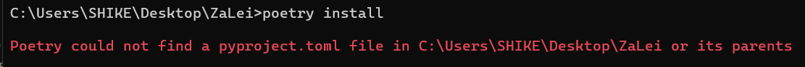

## 一：使用`poetry install`命令时报错



#### 解决办法：

1. 这是因为错误的路径没有 `pyproject.toml` 文件导致的

2. 建议你看看你自己的报错路径是什么 
 - 如图： C:\Users\SHIKE\Desktop\ZaLei 这并不是真寻Bot的文件夹
 - 需要你进入真寻的文件夹内重新使用（zhenxun_bot）

## 二：首次启动报错`ImportError: cannot import name 'connections' from 'tortoise'`

#### 解决办法：

1. 这是因为从 tortoise 包中导入 connections 失败了

2. 如已安装因尝试重新安装

```
pip uninstall tortoise-orm
pip install tortoise-orm
```

## 三：登录Gocq时出现 登录失败/Code: 45/限制非常用设备登录.等...

#### 解决办法：

1. TX对野生Bot的打压Gocq无力继续维护，已跑路

2. 使用签名服务再试：9.0.60以上（并不建议）

3. 根据本教程使用其他协议端登陆（建议）


## 四：使用Python 3.12无法运行真寻或者功能报错

#### 解决办法：

1. 这是因为目前为止真寻暂不支持使用Python 3.11及以上

2. 请更换Python 3.8~3.10（推荐3.10）
 - 目前真寻最高支持到`3.10.11`，后期会随着开发迭代提高版本

## 五：真寻与协议端不在同一服务器上发送图片显示`过期`

#### 解决办法：

1. 这是因为默认使用base64发送图片

2. 在配置文件`.env.dev`中配置`IMAGE_TO_BYTES`为`True`

## 六：初次启动真寻资源下载失败：404/超时等问题

#### 解决办法：

1. 404是因为下载源寄了

2. 超时是因为最新的真寻下载源Github部分使用了代理服务，因此需关闭自己本地的全局服务防止影响

## 七：真寻Bot动不动就骂自己

#### 解决办法：

1. AI插件导致的，要么别用这个，要么继续受（bushi

[其他问题建议看看Github的issues](https://github.com/HibiKier/zhenxun_bot/issues)说不定有你想要的答案