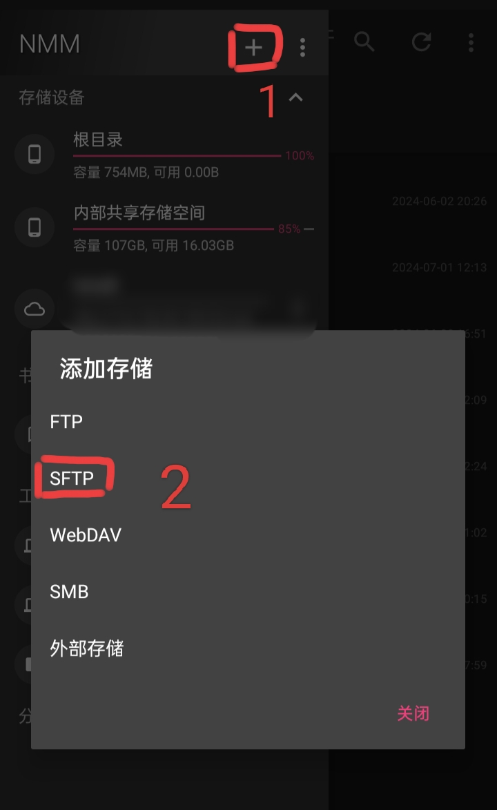
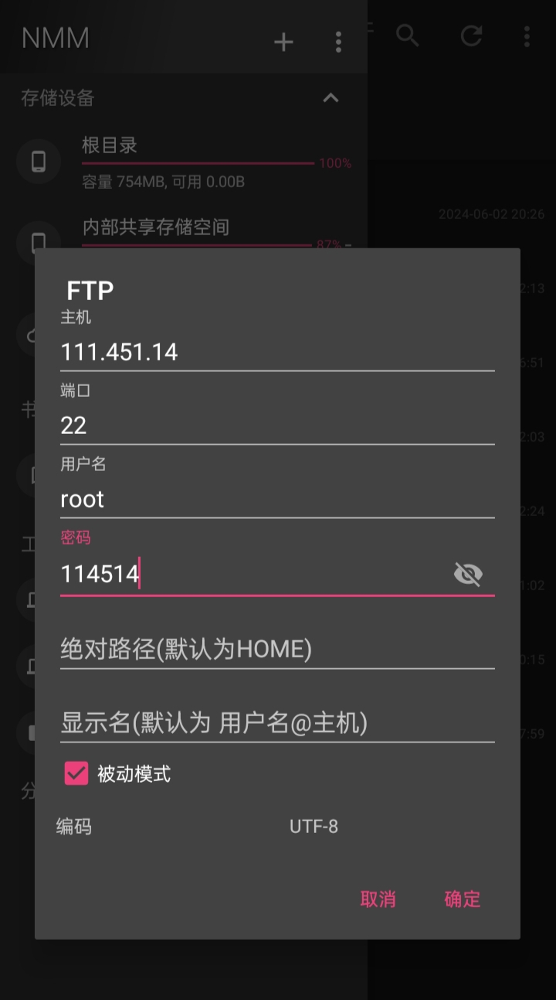
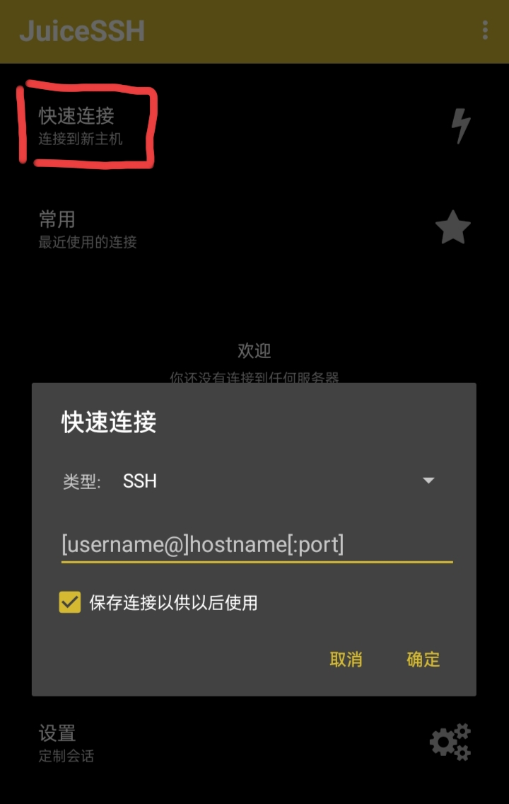

1. [点击此处下载JuiceSSH+NMM](https://musetransfer.com/s/zp0v5jxym)

2. 打开NMM左上角三个横杠再点击➕最后选择SFTP

3. 填写配置确定即可
 - 主机：IP
 - 用户名：默认为root（一般情况）
 - 密码：登录密码
 - 其他任意
 

 
4. 打开JuiceSSH点击快速连接

  
5. 配置连接
 - 格式就是：登录名@IP
 - 如：root@111.45.14
 - 最后确定输入密码