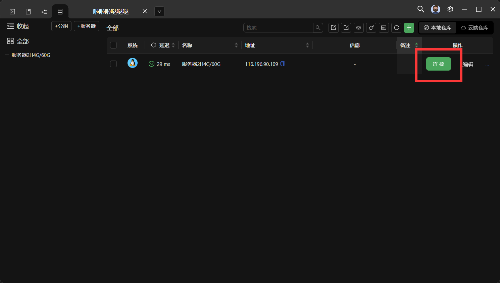
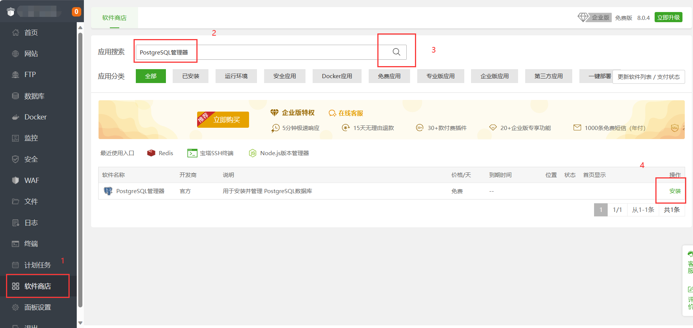
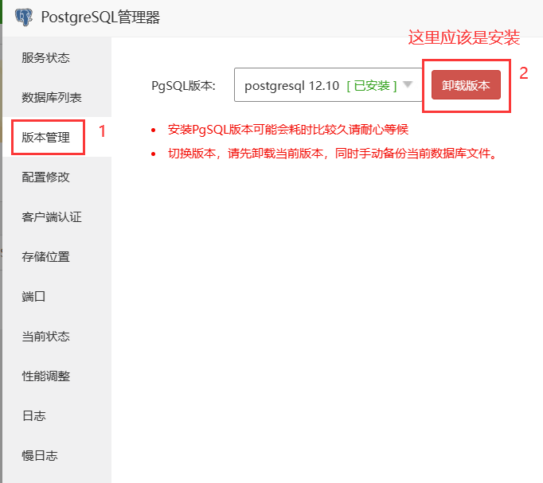

## 一 首先你应该准备一个Ubuntu22+并且是2H2G+的服务器

## 二 安装宝塔面板或者XTerminal(软件)

::: details 安装宝塔面板（不建议）

### 打开服务器控制台找到SSH连接工具输入下方内容回车即可

```
wget -O install.sh https://download.bt.cn/install/install-ubuntu_6.0.sh && sudo bash install.sh ed8484bec
```

### 等待安装完成后打开面板（密码请牢记，如无法打开请开放端口）

:::

::: details 安装XTerminal（用于连接ssh，Windows端）

1. [点击此处下载XTerminal](https://www.xterminal.cn)

2. 下载完成后打开点击新建服务器（+号）


3. 写上一个名字/ip地址/登录密码后创建即可


3.1 你的登录密码会在你的服务商控制台显示（不知道在哪里就去百度搜，太多了我没办法去列举每个服务商不一样）

4. 创建完成点击连接



:::

## 三 前置安装

安装poetry与ffmpeg和中文字体

打开终端输入下方内容

```
sudo apt update
sudo apt upgrade
sudo pip config set global.index-url https://pypi.tuna.tsinghua.edu.cn/simple
sudo apt install -y wget git screen ffmpeg
sudo apt install -y python3-pip
sudo pip install --upgrade pip
sudo pip install poetry
sudo apt-get install -y ttf-wqy-zenhei ttf-wqy-microhei fonts-arphic-ukai fonts-arphic-uming
sudo fc-cache -f -v
```

## 四 安装PostgreSQL数据库

::: details 使用宝塔面板安装PostgreSQL数据库（非终端）

1. 打开软件商店搜索PostgreSQL管理器并安装（默认安装即可）



2. 安装完成后点击`设置`


3. 然后点击`版本管理`，建议安装15以上的版本（时间较长）



4. 安装完成后点击`数据库列表`创建/添加数据库


5. `数据库名/用户名/密码`全部填写`zhenxun`后点击`确定`


:::

::: details 使用XTerminal安装PostgreSQL数据库（终端安装）

1. 安装PostgreSQL数据库

```
sudo apt install -y postgresql postgresql-contrib

```

2. 创建数据库（终端依次输入）

```
sudo su - postgres
psql
CREATE USER zhenxun WITH PASSWORD 'zhenxun';
CREATE DATABASE zhenxun OWNER zhenxun;
\q
exit
```

:::

### 备份PostgreSQL数据库

1. 打开终端，输入：（创建文件夹+赋予权限）

```
mkdir -p /tmp/Postgres-BF
sudo chmod -R 777 /tmp/Postgres-BF
```

2. 输入：（进入postgres，备份，输入密码，退出）

注意！！！需要完成`安装PostgreSQL数据库`全部步骤才能备份数据库
```
sudo -su postgres
pg_dump -U postgres -W -F t -b -v -f "/tmp/Postgres-BF/zhenxun.tar" zhenxun
zhenxun // 这里是上一条命令输入的密码！！！
exit
```

3. 备份的数据将在`/tmp/Postgres-BF/zhenxun.tar`

### 恢复备份的PostgreSQL数据库

注意！！！需要完成`安装PostgreSQL数据库 + 备份PostgreSQL数据库`全部步骤才能备份数据库

1. 终端输入：（赋予权限，进入postgres，恢复备份，退出），/tmp/Postgres-BF/zhenxun.tar是已有的备份压缩文件

```
sudo chmod -R 777 /tmp/Postgres-BF
sudo -su postgres
pg_restore -U postgres -d zhenxun -v "/tmp/Postgres-BF/zhenxun.tar"
exit
```

ok火速下一步
