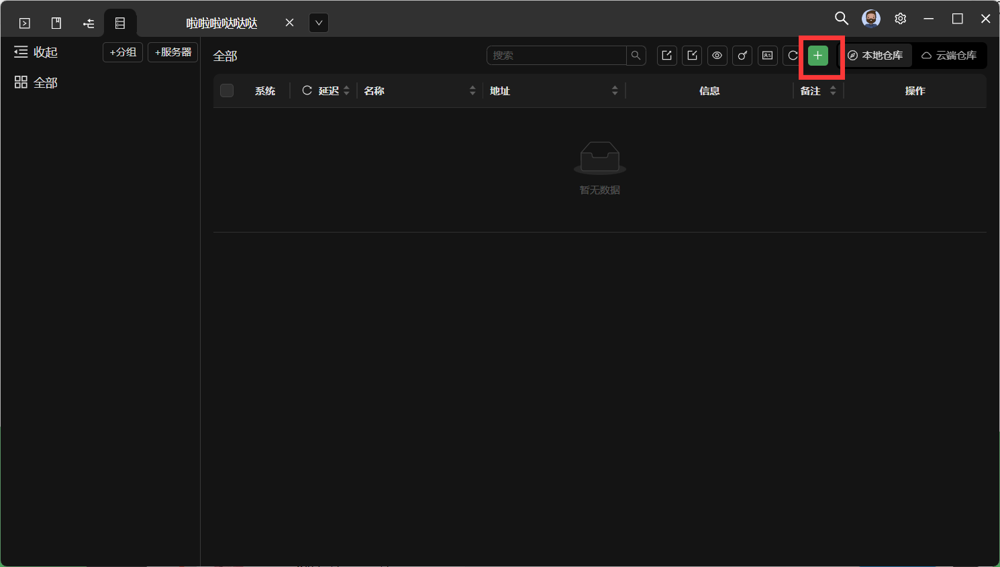
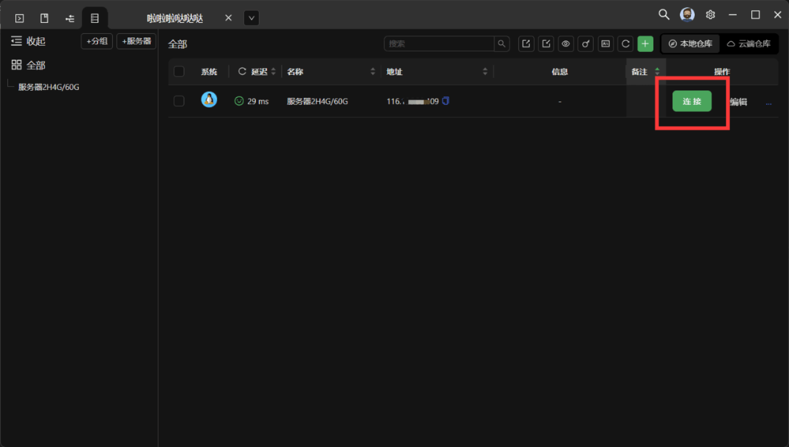

1. [点击此处下载XTerminal](https://www.xterminal.cn)
 - 下载 linux 桌面版 (x64)

2. 下载完成后打开与 XTerminal-X.X.X-linux-amd64.deb 同级目录的终端

3. 终端执行下方内容（XTerminal-X.X.X-linux-amd64.deb就算是你刚刚下载的文件名，以下载的名字为准）

```
sudo dpkg -i XTerminal-X.X.X-linux-amd64.deb
```


4. 打开XTerminal 点击靠着右上角的 +号（新建服务器）



4. 写上一个名字/ip地址/登录密码后创建即可


 - 你的登录密码会在你的服务商控制台显示（不知道在哪里可以去百度搜下）

5. 创建完成点击连接



## [➊ 返回上级](./)