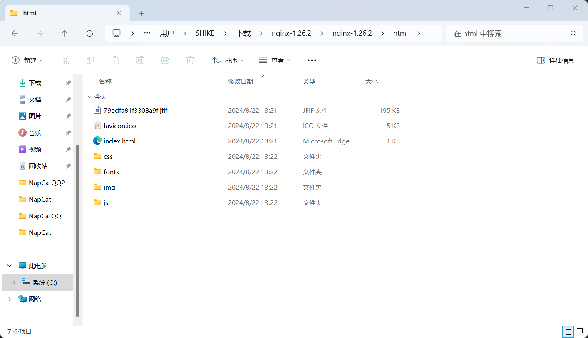
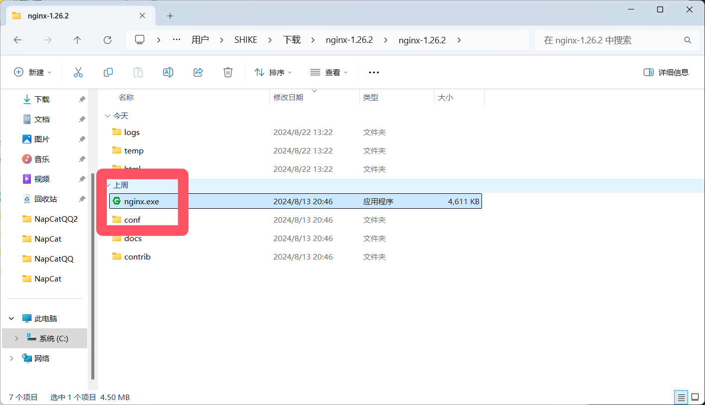

# 刚复制过来...咕咕咕..

## 安装Webui

1. 为了方便直接下载打包过的 Releases 
 - 不用考虑是否是最新

2. 在终端执行

```
wget -O /root/Bot/zhenxun_bot_webui https://mirror.ghproxy.com/https://github.com/HibiKier/zhenxun_bot_webui/archive/refs/tags/v0.2.zip && unzip /root/Bot/zhenxun_bot_webui -d /root/Bot/
```

3. 下载后解压并打开`zhenxun_bot_webui-0.2\zhenxun_bot_webui-0.2\dist`

## 安装Nginx

1. [点击击此处下载](https://nginx.org/download/nginx-1.26.2.zip)

2. 解压下载的Nginx
 - 打开目录`nginx-1.26.2\nginx-1.26.2\html`

3. 删除文件夹`nginx-1.26.2\nginx-1.26.2\html`中的Html文件=全部删掉

4. 复制`zhenxun_bot_webui-0.2\zhenxun_bot_webui-0.2\dist`的全部文件到`nginx-1.26.2\nginx-1.26.2\html`



## 运行Nginx

1. 打开目录`nginx-1.26.2\nginx-1.26.2\`运行`nginx.exe`
 - 没有窗口？正常情况



2. 在浏览器访问[http://localhost/](http://localhost/)

3. 你问密码是什么？
 - 没有欸，要自己配置一下呢

4. 打开`zhenxun_bot\data\config.yaml`
 - 没错是真寻Bot里面

5. 翻到82~83行修改密码即可
 - 不修改登录不了嗷

6. 然后重启一下真寻就可以了
