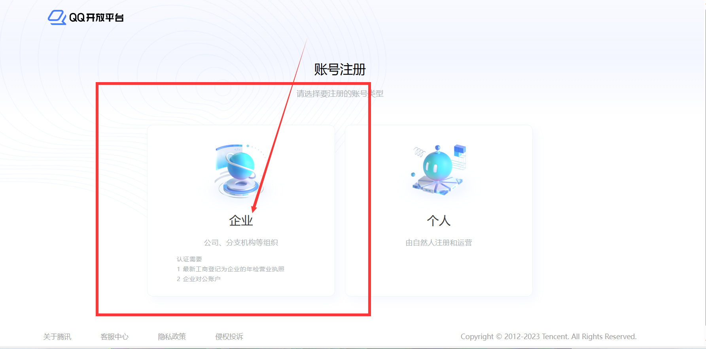
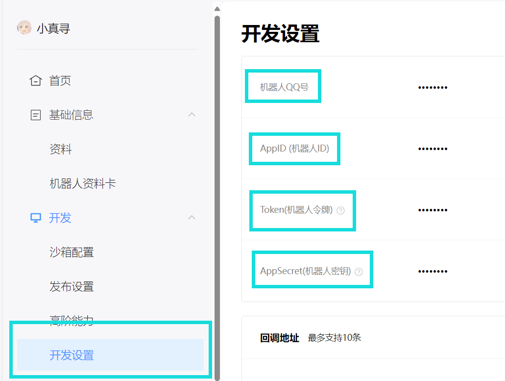
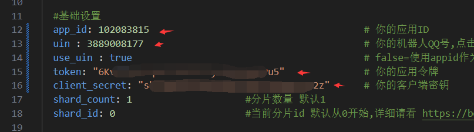
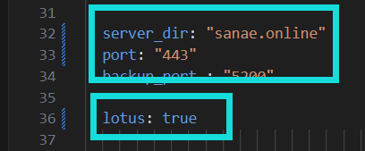
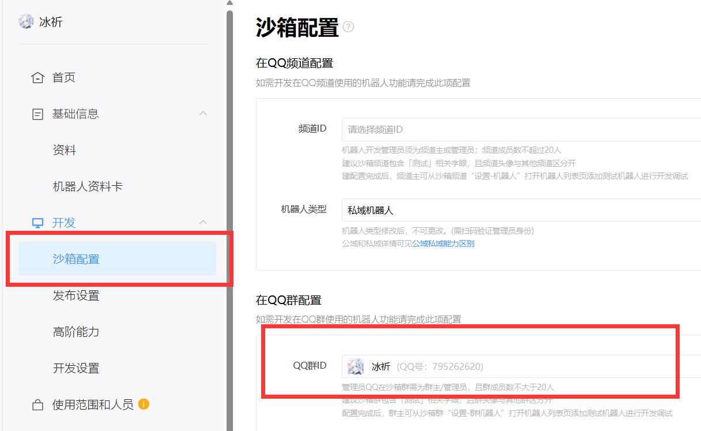

::: danger
没必要评价第三方好还是官方好，各有各的好处和弊端，能接受就用，接受不了就别用，别一天天的骂来骂去，~~你就算骂也别骂到人家开发者上去，咱能不能有点良心？~~
:::

::: danger
别拿着建议的理由去骂开发者，人家更不更新跟你什么关系，没强迫你更新吧？你要是认为Gensokyo更新太快就别用，把开发者气跑了你就开心高兴了？
:::

## 一 说明：

1. 新框架`Gensokyo` 视频：[https://www.bilibili.com/video/BV1Aw411K7Z5](https://www.bilibili.com/video/BV1Aw411K7Z5)

2. `Gensokyo`仓库：[https://github.com/Hoshinonyaruko/Gensokyo](https://github.com/Hoshinonyaruko/Gensokyo)

3. `Gensokyo`gitee镜像：[https://gitee.com/sanaefox/Gensokyo](https://gitee.com/sanaefox/Gensokyo)

4. `Gensokyo`教程 [https://www.bilibili.com/read/cv27523883](https://www.bilibili.com/read/cv27523883)

5. `Gensokyo`的`web端`用户名和密码已全部修改为`zhenxun`

6. `Gensokyo` QQ群：196173384

## 二 注册企业账号

1. 随随便便注册一个企业qq开放平台账号：[https://q.qq.com](https://q.qq.com)



2. 登录企业qq开放平台账号并创建机器人


3. 填好信息后点击下一步

4. 打开后点击`基础信息-信息`


5. 点击`详情`


6. 点击`进入认证`后填写相关信息并点击提交审核进行认证（目前不认证无法上线机器人，可沙箱使用）


## 三 下载配置Gensokyo

1. 下载gensokyo-linux-amd64（取用v336，更新时间2024.2.24，且此时应该在root/Bot目录）若发现教程的Gensokyo版本更新，可以选择无视更新
```
git clone --depth 1 -b gensokyo-linux-amd64 https://gitee.com/SHIKEAIXY/zhenxun.git ./Gensokyo
```

2. 打开下载的`Gensokyo`后并双击打开`config.yml`（此时应该在root/Bot/Gensokyo路径中）

3. 打开之前的网站`q.qq.com`点击`开发-开发设置`并复制`ID 令牌 秘钥`填写到`config.yml配置文件`的7~10行





4. 将自己服务器的公网ip填入`server_dir`


5. 并开放端口号`15630`（不配置将无法发送图片，不会就百度搜下吧）

6. 如果你没有公网ip可使用早苗的图床

将`server_dir`和`port`修改为下方内容

```
server_dir: "sanae.online"
port: "443" 
``` 
然后将`lotus`的`false`设置为`true`后保存即可使用



7. 以上完成后，输入下方内容命令（此时应该在root/Bot/Gensokyo路径中）

```
screen -S gsk
./gensokyo-linux-amd64
```
如果执行上方命令后出现出现`-bash: ./gensokyo-linux-amd64: Permission denied`可使用下方命令赋予权限并使用sudo执行
```
chmod +x gensokyo-linux-amd64
sudo ./gensokyo-linux-amd64
```

8. 关于screen命令说明：

* screen命令一般用于Linux的持久化运行
* 其中下方命令当中的name为创建screen窗口的名称
```
screen -S name //创建一个screen窗口
screen -r name //打开这个screen窗口
screen -ls     //查看全部screen窗口
screen -S name -X quit  //删除这个screen窗口
```

## 五 配置沙箱使用机器人

1. 打开QQ点击新创建聊群（不超过20人的群）

2. 再次回到网站`q.qq.com`

3. 点击`开发-沙箱配置`后找到`在QQ群配置`将聊群修改为刚刚创建的聊群（如果失败就几秒后再试试）



4. 接下来回到QQ打开刚刚创建的聊群，点击右上角的`三个横杠`，点击`管理群-群机器人`，找到你的机器人点击添加

5. 接下来@机器人并发送真寻帮助查看是否可以发图  如：@冰祈 真寻帮助

6. 如果不行自己查看上文中让填写的ip是否为公网ip并且开放了端口号，如都设置了还不行那就去Gensokyo群问，我不到啊

::: tip
 `zhenxun_bot`与`Gensokyo`需全部运行，不可关闭
:::