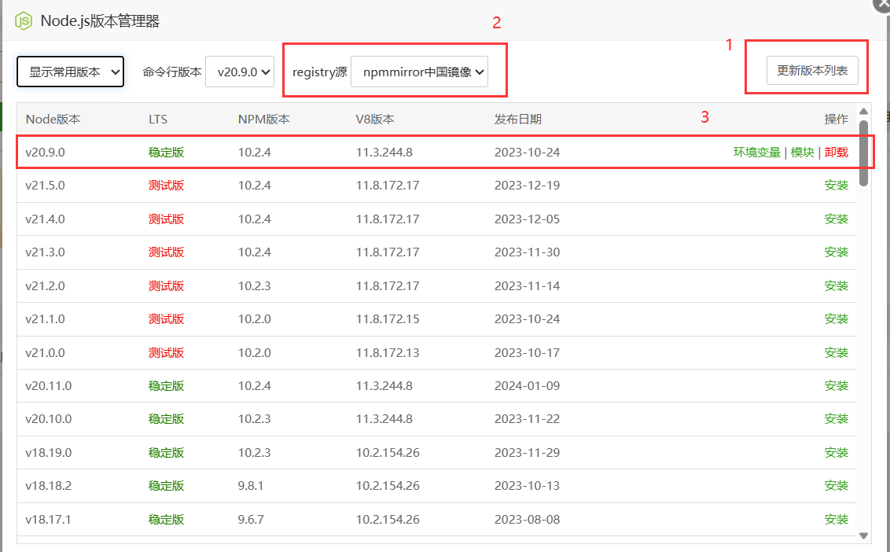

### 安装云崽

#### ①安装前置

1. 下载node.js

<details>
  <summary>使用宝塔面板安装node.js（非终端）</summary>

打开宝塔的软件商店搜索`Node.js版本管理器`并下载20.9.0的版本（也可以下载16/18的版本）



</details>

<details>
  <summary>使用XTerminal安装node.js（终端安装）</summary>

终端依次输入下方内容

```
sudo apt install apt-transport-https curl ca-certificates software-properties-common
curl -sL https://deb.nodesource.com/setup_18.x | sudo -E bash -
sudo apt-get install -y nodejs
```

</details>

2.安装云崽机器人（此时应该在root/Bot目录）

```
bash <(curl -L https://gitee.com/SHIKEAIXY/zhenxun/raw/linux/Yunzai.sh)
```

<details>
  <summary>如果不想使用sh一键下载可点击此处手动下载</summary>

&nbsp;2.1. 在终端root/Bot目录依次输入以下内容并回车 

```
git clone --depth=1 https://gitee.com/yoimiya-kokomi/Miao-Yunzai.git ./Miao-Yunzai/
```
```
cd Miao-Yunzai
```
```
git clone --depth=1 https://gitee.com/yoimiya-kokomi/miao-plugin.git ./plugins/miao-plugin/
```
```
git clone --depth=1 https://gitee.com/xiaoye12123/ws-plugin.git ./plugins/ws-plugin/
```
```
npm --registry=https://registry.npmmirror.com install pnpm -g
```
```
//可选
pnpm config set registry https://registry.npmmirror.com
```
```
pnpm i
```
```
pnpm add puppeteer@19.7.3 -w
```
</details>
&nbsp;

3. 安装redis数据库

<details>
  <summary>使用宝塔面板安装redis数据库（非终端）</summary>

还是打开软件商店搜索`redis`（剩下的你自己搞吧，这么简单你不会还不会吧？）

</details>

<details>
  <summary>使用XTerminal安装redis数据库（终端安装）</summary>

终端输入下方内容

```
sudo apt install redis-server
```

安装完成后 Redis 服务会自动启动

可以使用以下命令来检查 Redis 服务的运行状态（如果 Redis 服务正在运行，你将看到类似于 "active (running)" 的输出）

```
sudo systemctl status redis-server
```

Redis 在系统启动时自动启动可以使用下方命令

```
sudo systemctl enable redis-server
```

</details>

4. 安装unidbg-fetch-qsign（此时应该在root/Bot目录）

先安装一下jdk
```
sudo apt update&&sudo apt install openjdk-8-jdk
```

然后下载unidbg-fetch-qsign
```
git clone --depth 1 https://gitee.com/touchscale/Qsign
```

然后启动unidbg-fetch-qsign（此处的8.9.78可修改）
```
cd Qsign
screen -S api
cd unidbg-fetch-qsign&&bash bin/unidbg-fetch-qsign --basePath=txlib/8.9.78
```

#### ④机器人/配置（此时应该在root/Bot目录执行）

```
cd Miao-Yunzai
screen -r yunzai
node app
```

1. 请输入机器人QQ号(建议用小号)：`这里输入机器人的QQ号即可`

2. 请输入登录密码(为空则扫码登录)：`这里输入机器人的QQ密码即可`

3. 请选择登录端口：`这里请通过方向键选择aPad！！！`（图片选错了，别跟着图片走！！！）

4. 请输入主人QQ号：`这里输入用来管理机器人的QQ号即可`

5. 请输入签名API地址（可留空）：`这里输入下方内容即可`

```
http://http://127.0.0.1:801/sign?key=114514
```

<details>
  <summary>使用他人提供的签名API</summary>

1. 签名API推荐使用78或85.
2. 由于签名API来自他人部署可能不稳定谨慎使用
3. API收集来自煌,聊群：695596638

<details>
  <summary>煌提供的签名API</summary>

1. 煌群：695596638

```
======「8.9.78」======
https://huai-huai-8-9-78.hf.space/sign?key=ngm
```
</details>

<details>
  <summary>叽叽叽提供的签名API</summary>

1. 叽叽叽群：未知

```
======「8.9.78/83/90/93」======
http://114.132.243.116:10078/sign?key=114514
======「在config/bot.yaml里添加：（XXX为版本如ver: 83）」======
======「ver: XXX」======
```
</details>

<details>
  <summary>小运提供的签名API</summary>

1. 小运群：未知

```
======「8.9.78」======
ttp://salipet.com:1535/sign?key=2394
======「8.9.83」======
http://salipet.com:1692/sign?key=2394
```
</details>

<details>
  <summary>咕咕咕提供的签名API</summary>

1. 咕咕咕群：235589956或339695166
2. 签名状态：http://47.108.180.154:3001/status/qsign
```
======「8.9.78」======
http://47.108.180.154:8978/sign?key=114514  
======「8.9.85」======
http://47.108.180.154:8985/sign?key=114514
======「8.9.88」======
http://47.108.180.154:8988/sign?key=114514
======「8.9.90」======
http://47.108.180.154:8990/sign?key=114514
======「8.9.93」======
http://47.108.180.154:8993/sign?key=114514
```
</details>

</details>


5. 触发滑动验证，需要获取ticket通过验证，请选择获取方式:`这里选择 0.自动获取ticket 进行扫码即可`

6. 查看云崽bot是否正常运行，如运行成功请关掉云崽重新输入`node app`并回车启动机器人

7. 连接本地bot(给云崽机器人QQ发送)

```
#ws添加连接
``` 
```
zhenxun_bot,1
``` 
```
ws://127.0.0.1:8080/onebot/v11/ws/
``` 
8. 发送`#ws查看连接`来查看是否连接成功

出现带以下内容的图片，则代表连接成功
```
连接名字: zhenxun_bot
连接类型: 1
当前状态: 已连接
```
### 注意不要关闭云崽和真寻本体

如果连接失败大概率就是你关了真寻或者真寻启动失败了
