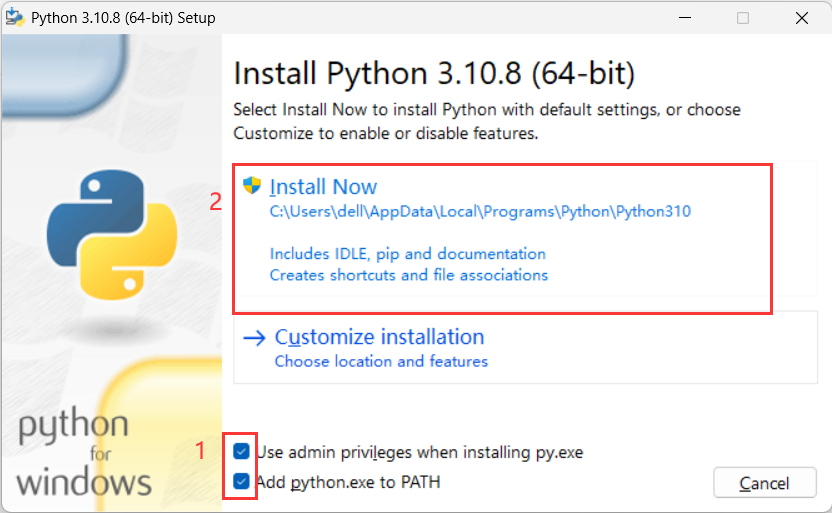
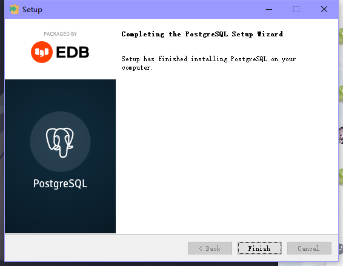
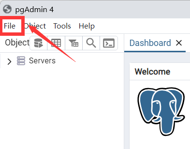
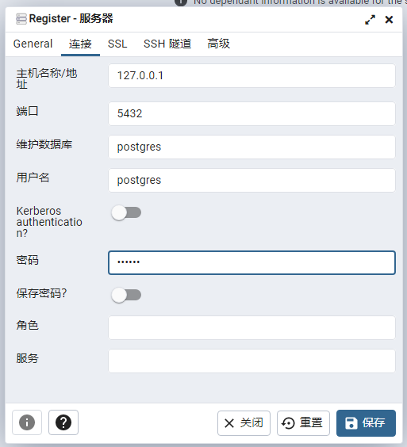

# ➊ 首先你应该准备一个2核4G+并且是Win10+(2016+推荐最新)的服务器(推荐使用Linux)

---

# ➋安装 版本大于3.9以上Python 与 任意版本的Poetry

## ①安装python

这里我推荐安装Python3.10

[点击下载py3.10](https://musetransfer.com/s/mpvqvvofz)

下面两个对钩点上 然后点击Install Now等待安装完成



安装完成打开cmd输入py 查看是否有py版本输出

## ②安装poetry

1. 使用pip安装
```
python -m pip install -U pip
```
```
pip install poetry
```

2. 打开cmd发送poetry查看是否有版本输出

如果没有请重启电脑 重新打开cmd输入 poetry

还不行？[点击此处解决](https://cn.bing.com)

---

# ➌ 安装postgresql

## ①下载Postgresql数据库
[点击此处将下载Postgresql-16.3-2版本安装包](https://get.enterprisedb.com/postgresql/postgresql-16.3-2-windows-x64.exe)

不想要16.3-2版本的可以自行下载别的版本（尽量使用新版）

## ②安装postgresql数据库

1.双击安装程序，点击Next（打不开报错？系统用户名不能是中文，计算机名也不能是中文，其他问题。。。不要找我 我也不会）


2.选择安装路径（对路径没有要求不用改 默认c盘），继续Next

安装路径中不要出现中文！（防止报错）


3.去掉即可，不影响使用，Stack BuilderNext


4.数据存储路径（对路径没有要求不用改 默认c盘），Next


5.输入postgres用户的密码，例如：zhenxun（防止后期问题请按照本教程的密码输入 上下全部输入zhenxun）


6.默认端口，Next


7.接下来一路点Next直到进入安装


8.显示下面的图 代表你安装完成



## ③配置连接

1.找到安装的pgAdmin启动数据库 并启动

打开方法： 在应用中搜索 pgAdmin 点击展开 找到下面img显示的打开即可


设置中文：

点击左上角的`file`



然后再点击左上角的`Preferences`


然后依次点击图片中数字的位置


2.新建连接

点击`Servers`


然后输入密码勾选保存后确定即可（密码是zhenxun 前面设置的密码）


左侧栏右键点击后选择，在点击ServersRegister服务器


随便给它起一个响亮的名字（


填写配置，如果是连接远程服务器的话对应的服务器IP，本地的话可以直接填写 就是安装时配置的端口，没有修改的话默认

就是安装时配置
的密码主机名称/地址127.0.0.1端口5432 密码就是你安装是输入的密码（本教程前面用的是zhenxun）



 3.点击保存
左侧栏会出现一个可爱真寻


## ④新建数据库

1.点击展开

2.右击，选择后点击数据库创建数据库


3.直接创建

设置数据库名称后点击保存 


ok火速下一步

## [➊ 前往安装真寻本体](../安装zhenxun_bot/)
