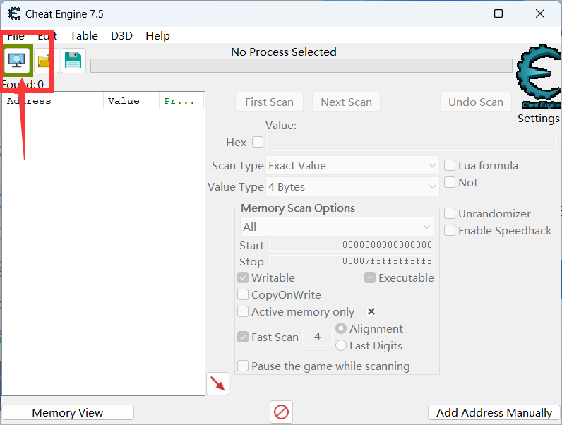
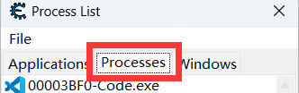
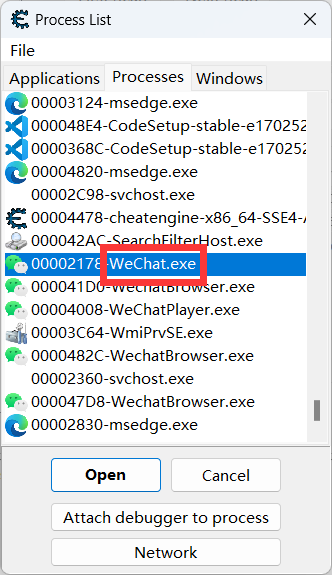
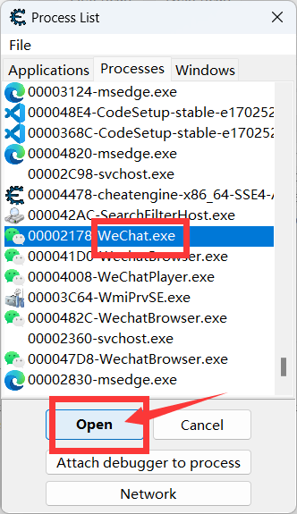
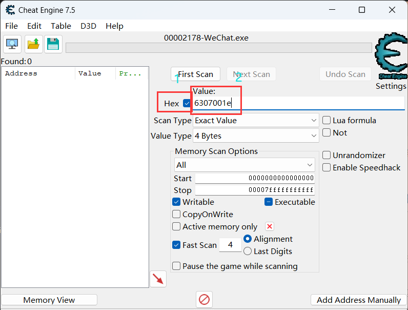
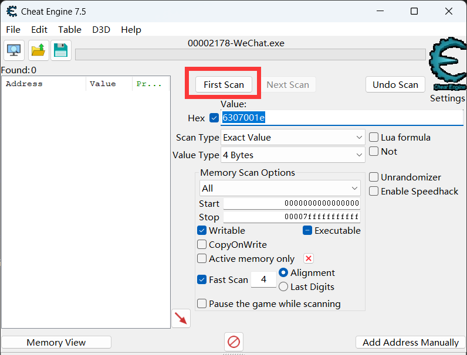
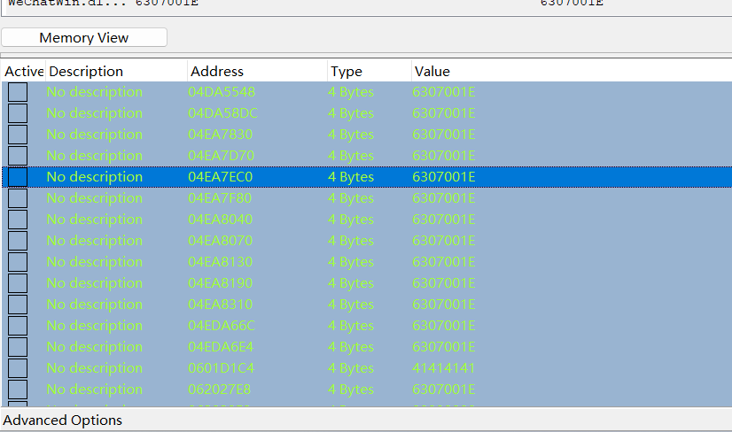
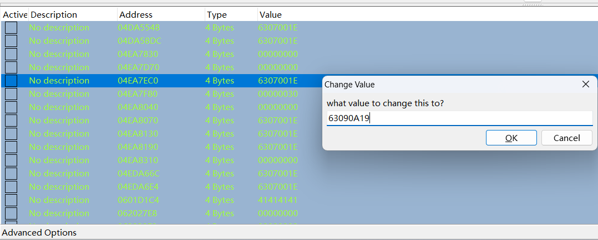
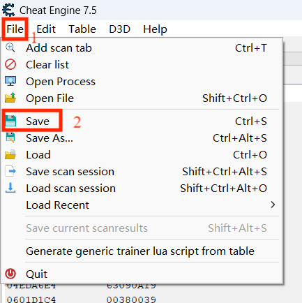

## ①下载WeChat微信

版本有限制，请务必安装下方链接中的微信客户端！！！(已有微信需卸载后再安装)

[点击我进行下载WeChat](https://musetransfer.com/s/edx8lnrvo)

## ②登录微信（微信账号需要实名）

登录后，可选安装禁用更新补丁防止自动更新，[点击此处下载禁用微信更新](https://gitee.com/SHIKEAIXYY/Trss-ComWeChat-Yunzai/releases/download/1.1/禁用pc微信自动升级补丁.exe)


## ③下载ComWeChat

```
git clone --depth 1 -b ComChat https://gitee.com/SHIKEAIXY/zhenxun.git ./ComWeChat
```

## ④运行ComWeChat

1. 请先下载vc库，请正确下载电脑适用的版本，安装完成未生效请重启电脑

2. [点击此处下载vc库](https://learn.microsoft.com/zh-cn/cpp/windows/latest-supported-vc-redist?view=msvc-170)

3. 打开 ComWeChat 文件夹

4. 双击运行`install.bat`(报错就是vc库没安装)

6. 双击运行`ComWeChat-Client-v0.0.8.exe`后等待连接

# 请保持真寻Bot，ComWeChat，微信的运行，不要关闭

# 关于低版本微信无法登录问题

这个问题原因是
 - tx会联网检测版本号
 - 当小于一定的值时就会去禁止我们登录
   - 假设这个值为5，当大于5时跳过，当小于5时就会禁止我们登录
 - 由此可知，为了防止无法登录我们有必要将版本号修改为大于tx的设定的值
   - 由于我们不知道这个值是多少，所以修改时可以修改为当前最新版微信版本号
   
## 解决办法

# [点击查看视频教程](https://www.bilibili.com/video/)
<BiliBili bvid="BV1nt421A7y5" />

由上文可知原理，所以我们可以用`Cheat Engine`去进行修改

[点我下载Cheat Engine](https://www.cheatengine.org/downloads.php)

1. 下载完成后`点击`



2. 打开`微信`（待扫码状态）

3. 选择`Processes`



4. 找到`数字/字母-Wechat.exe`后点击



5. 再点击`Open`



6. `勾选Hex`后`替换000000`为`下方内容`即可

```
6307001E
```



7. 然后点击`FIrst Scan`



8. 然后`ctrl+A全选`后`点击箭头`


9. 然后继续`ctrl+A全选`下面的内容



10. 然后`左键点击参数`修改为`下方内容`（使用最新3.9.11.17）

```
63090B11
```



11. 然后点击`OK`

12. 保存修改数据（并非永久生效，重新登录需再次修改，本步骤是保存CT文件，方便下次进行修改）


