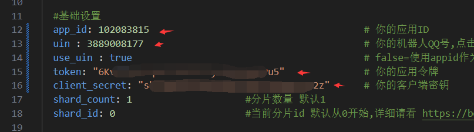
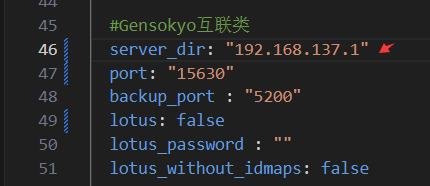
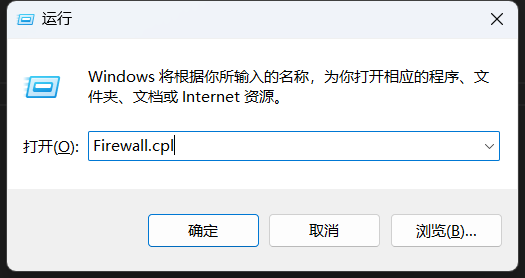
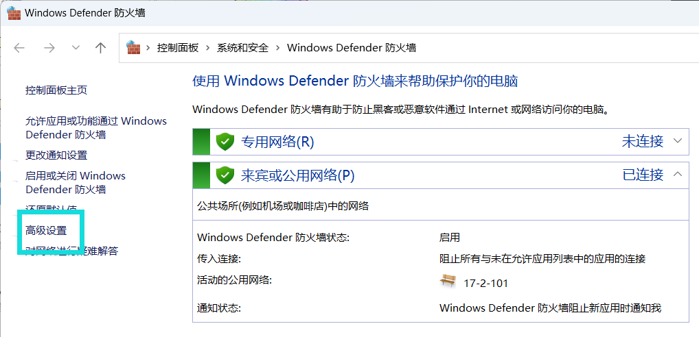
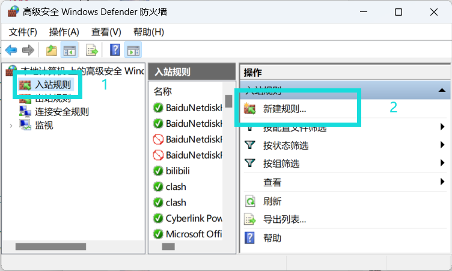
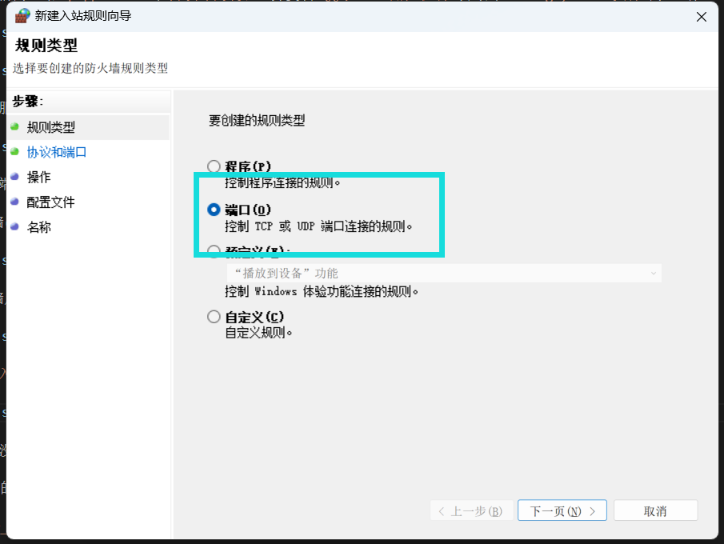

::: danger
没必要评价第三方好还是官方好，各有各的好处和弊端，能接受就用，接受不了就别用，别一天天的骂来骂去，~~你就算骂也别骂到人家开发者上去，咱能不能有点良心？~~
:::

### ①说明：

1. 新框架`Gensokyo` 视频：

<BiliBili bvid="BV1Aw411K7Z5" />

2. `Gensokyo`仓库：[Hoshinonyaruko/Gensokyo](https://github.com/Hoshinonyaruko/Gensokyo)

3. `Gensokyo`gitee镜像：[sanaefox/Gensokyo](https://gitee.com/sanaefox/Gensokyo)

4. `Gensokyo`教程 [cv27523883](https://www.bilibili.com/read/cv27523883)

5. `Gensokyo`的`web端`用户名和密码已全部修改为`zhenxun`

6. `Gensokyo` QQ群：196173384

### ②注册个体账号

1. 注册一个企业qq开放平台账号：[点我前往注册](https://q.qq.com/#/register?developerType=1)

2. 登录企业qq开放平台账号并创建机器人


3. 填好信息后点击下一步（我相信你会）

### ④下载配置Gensokyo

1. 下载gensokyo-windows-amd64（取用v459，更新时间2024.7.10）若发现教程的Gensokyo版本更新，可以选择无视更新

```
git clone --depth 1 -b gensokyo-windows-amd64 https://gitee.com/SHIKEAIXY/zhenxun.git ./Gensokyo
```

2. 打开下载的`Gensokyo`后并双击打开`config.yml`

3. 打开之前的网站`q.qq.com`点击`开发-开发设置`并复制`QQ号 ID 令牌 秘钥`填写到`config.yml配置文件`的7~9行




4. 填写公网IP至开放平台（不填写无法上线和连接Bot）


5. 将自己服务器的公网ip填入`server_dir`



6. 并开放端口号`15630`（不配置将无法发送图片）

打开防火墙(不会可以`按住win键+R键`输入`Firewall.cpl`并点击确定)



打开防火墙后点击`高级设置`



然后点击`入站规则`并`新建规则`



选择端口后下一页



然后填写端口`15630`并下一页


然后一直下一页即可，名字随便起

记得服务器控制台那边也要开放端口`15630`！！！

7. 以上完成后双击运行`gensokyo.bat`不出意外就可以运行了

### ⑤配置沙箱使用机器人

1. 打开QQ点击新创建聊群（不超过20人的群）

2. 再次回到网站`q.qq.com`

3. 点击`开发-沙箱配置`后找到`在QQ群配置`将聊群修改为刚刚创建的聊群（如果失败就几秒后再试试）


4. 接下来回到QQ打开刚刚创建的聊群，点击右上角的`三个横杠`，点击`管理群-群机器人`，找到你的机器人点击添加

5. 接下来@机器人并发送真寻帮助查看是否可以发图  如：@绪山小真寻 真寻帮助

6. 如果不行自己查看上文中让填写的ip是否为公网ip并且开放了端口号，如都设置了还不行那就找作者去，我不到啊

## 至于怎么上线你自己研究吧

::: tip
 `zhenxun_bot`与`Gensokyo`需全部运行，不可关闭
:::
