::: danger
没必要评价第三方好还是官方好，各有各的好处和弊端，能接受就用，接受不了就别用，别一天天的骂来骂去，~~你就算骂也别骂到人家开发者上去，咱能不能有点良心？~~
:::

### ①说明：

1. 新框架`Gensokyo` 视频：

<BiliBili bvid="BV1Aw411K7Z5" />

2. `Gensokyo`仓库：[Hoshinonyaruko/Gensokyo](https://github.com/Hoshinonyaruko/Gensokyo)

3. `Gensokyo`gitee镜像：[sanaefox/Gensokyo](https://gitee.com/sanaefox/Gensokyo)

4. `Gensokyo`教程 [cv27523883](https://www.bilibili.com/read/cv27523883)

5. `Gensokyo` QQ群：196173384

6. 本教程以 Gensokyo V495 && QQ开放平台个体账号 为例

7. 需要`公网IP` 如果没有...不是哥们

### ②注册个体账号

1. 注册一个QQ开放平台账号：[点我前往注册](https://q.qq.com/#/register?developerType=1)

2. 登录QQ开放平台账号并创建机器人

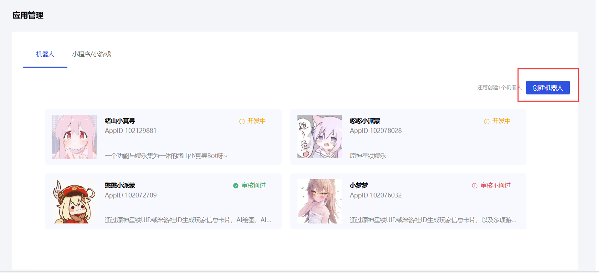

3. 填好信息后点击下一步（我相信你会）

### ④下载配置Gensokyo

1. [点击此处前往Github Releases下载](https://github.com/Hoshinonyaruko/Gensokyo/releases)

2. 下载最新版本`Gensokyo`中的`gensokyo-windows-amd64.exe`

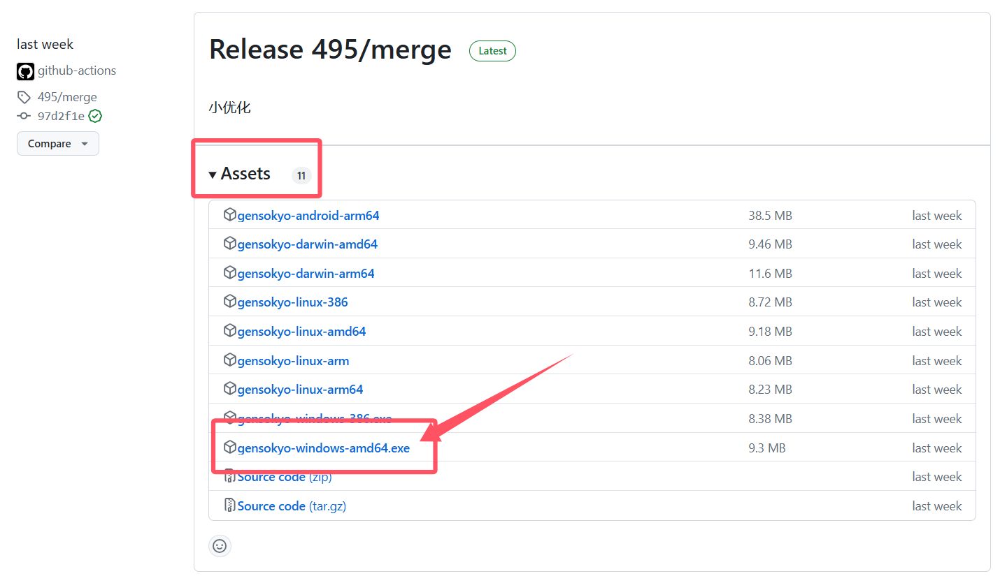

3. 打开下载的`gensokyo-windows-amd64.exe`后并双击运行
 - 这里会生成多个文件，建议放进一个合适的文件夹

4. 出现弹窗，一直点确定即可

5. 双击运行`gensokyo.bat`

6. 打开`config.yml`配置文件

7. 修改`第5行`中""内的部分为：

```
ws://127.0.0.1:8080/onebot/v11/ws/
```

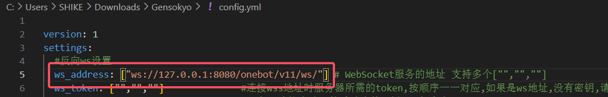

8. 打开之前的网站`q.qq.com`点击`开发-开发设置`并复制`QQ号 ID 令牌 秘钥`填写到`config.yml配置文件`的12~16行

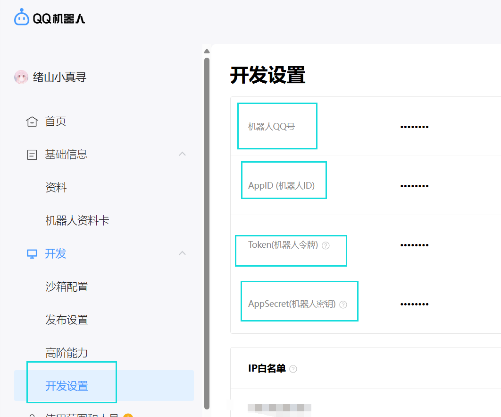

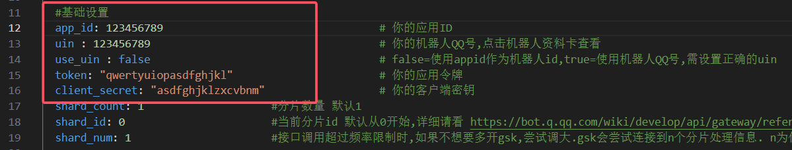

9. 注释`事件订阅`中群里以外的全部内容：

 - 注释在前面仍个`#`就可以了
 - 取消注释删掉`#`就可以了
 - 要注意不注释的内容把`-`和上面的`#`对齐嗷

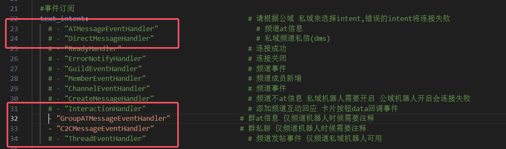

10. 填写公网IP至开放平台（不填写无法上线和连接Bot！！！）


11. 将自己服务器的公网ip填入`server_dir`
 - 是挂载`Gensokyo`的服务器的嗷，因为tx要用这个IP从你服务器上访问图片

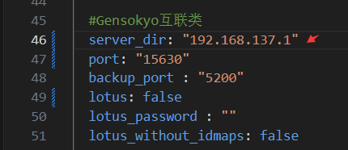

12. 打开94~96行
 - 这里是Web端的密码（看看就好辣）

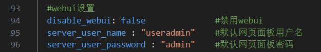

13. 再往下看看也就是99~102行，修改配置
 - remove_prefix和add_at_group全部改为true

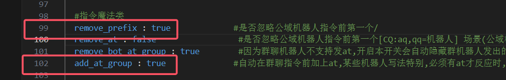

14. 其他配置其实也可以自己看看，注释给的挺清楚的（就算不在改也可以）千万要记得保存修改！！！

15. 开放端口号`15630`（不配置将无法发送图片）

打开防火墙(不会可以`按住win键+R键`输入`Firewall.cpl`并点击确定)

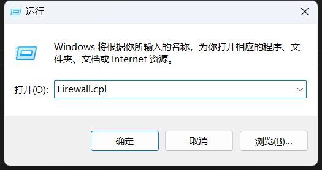

16. 打开防火墙后点击左侧的`启用或关闭 Windows Defender 防火墙`
 - 全部关闭嗷！

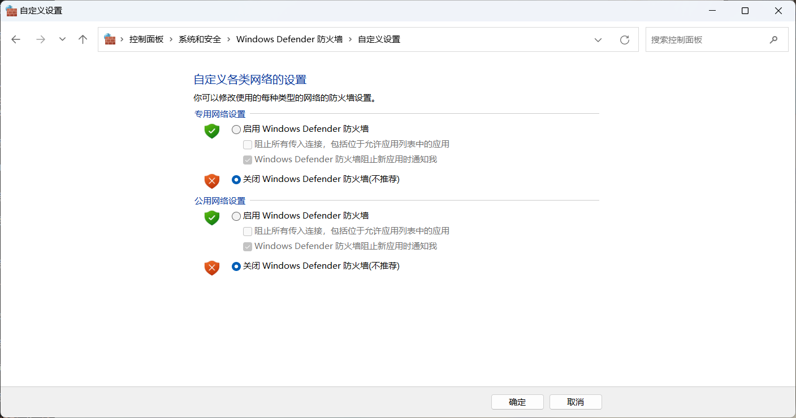

17. 打开你服务器的控制台（哪家买的搜这家通常有教程）

18. 打开控制台的`防火墙/安全组`
 - 新建安全组
 - 开放端口`15630`
 - IP：0.0.0.0/0
 - 其他默认即可

19. 以上完成后双击运行`gensokyo.bat`不出意外就可以运行了

### ⑤配置沙箱使用机器人

1. 打开QQ点击新创建聊群（不超过20人的群）

2. 再次回到网站`q.qq.com`

3. 点击`开发-沙箱配置`后找到`在QQ群配置`将聊群修改为刚刚创建的聊群（如果失败就几秒后再试试）

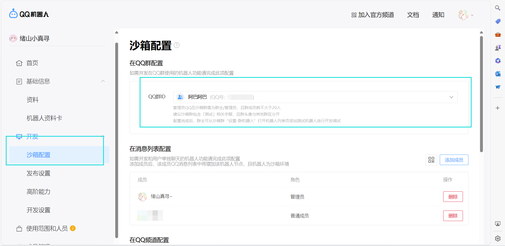

4. 接下来回到QQ打开刚刚创建的聊群，点击右上角的`三个横杠`，点击`管理群-群机器人`，找到你的机器人点击添加

5. 接下来@机器人并发送真寻帮助查看是否可以发图  如：@绪山小真寻 真寻帮助

6. 如果不行自己查看上文中让填写的ip是否为公网ip并且开放了端口号，如都设置了还不行那就找作者去，我不到啊

## 至于怎么上线你自己研究吧

::: tip
 `zhenxun_bot`与`Gensokyo`需全部运行，不可关闭
:::
