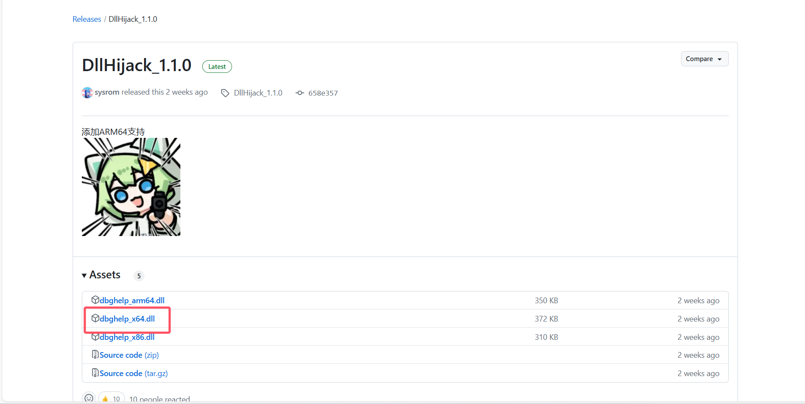
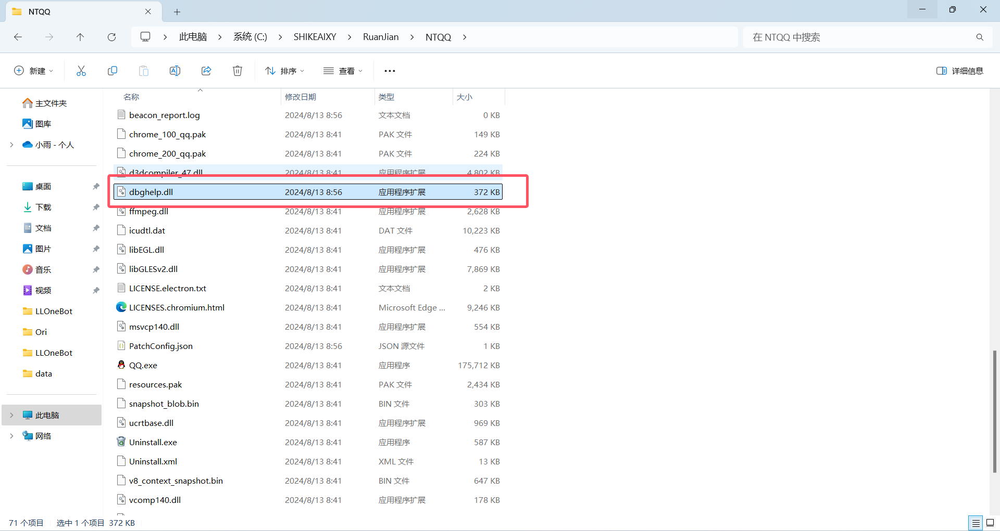
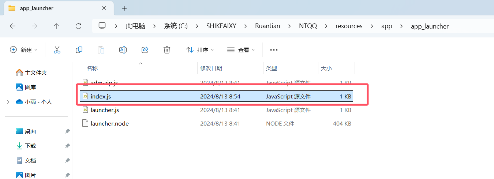
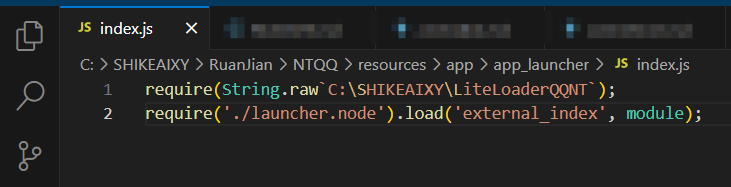
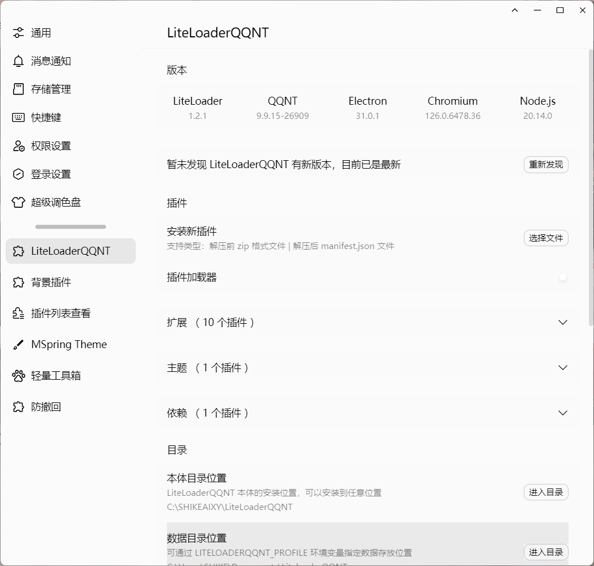

::: danger
本站该教程已经过作者允许上传

另外请勿将与本教程任何相关内容上传至流量平台如：B站
:::

# ①NapCat Framework 相关

1. NapCat Framework可以使你成为人机X（人机合一）

2. NapCat Framework是基于 PC NTQQ 本体实现一套无头 Bot 框架。

3. NapCat Framework可以使你的 NTQQ 支持 OneBot 11 协议进行 QQ 机器人开发的无需GUI界面的NTQQ

4. [LiteLoaderQQNT官方文档](https://liteloaderqqnt.github.io)

5. 本教程以 LiteLoaderQQNT V1.2.1  && NapCat Framework V2.0.37 && DllHijack v1.1.0 && NTQQ v9.9.15-26909 为例
 - NapCat Framework V2.0.37 是唯一一个支持使用LiteLoaderQQNT运行的版本

## ②安装NTQQ

1. [点击此处前往QQ官网下载NTQQ](https://dldir1.qq.com/qqfile/qq/QQNT/448e164c/QQ9.9.15.26909_x64.exe)（必须26702-26909）

2. 安装NTQQ

## ③下载并配置 LiteLoaderQQNT

1. 通过git clone下载 [LiteLoaderQQNT](https://github.com/LiteLoaderQQNT/LiteLoaderQQNT) (在任意位置终端运行，记住安装 的位置)

```
git clone --depth 1 https://mirror.ghproxy.com/https://github.com/LiteLoaderQQNT/LiteLoaderQQNT.git
```

2. 通过 DLLHijackMethod 方法进行修补

[点击此处前往releases下载DllHijack](https://github.com/LiteLoaderQQNT/QQNTFileVerifyPatch/releases)

 尽量下载新版 DllHijack 在新版中可能解决了旧版存在在Bug
 - 通常情况下win下载x64
 - 点击 Assets 下载 dbghelp_x64.dll



最后将下载的dbghelp_x64.dll重命名为dbghelp_.dll

```
dbghelp_.dll
```

3. 打开安装的QQNT目录

找到你桌面的QQ


鼠标对着他右键并点击打开文件所在位置（win10可能有所不同）


4. 复制刚刚下载并重命名的dbghelp_.dll粘贴到刚刚打开的目录（与QQ.exe同级目录）



5. 编辑 resources\app\app_launcher\index.js 文件



6. 将原有的内容全部替换成下方内容

```
require(String.raw`安装路径`);
require('./launcher.node').load('external_index', module);
```

7. 将替换的内容：安装路径改为你③中git clone下载的LiteLoaderQQNT安装路径，如：C:\SHIKEAIXY\LiteLoaderQQNT



8. 然后重启 NTQQ 并打开设置查看是否安装成功


## [➊ 返回上级](./)