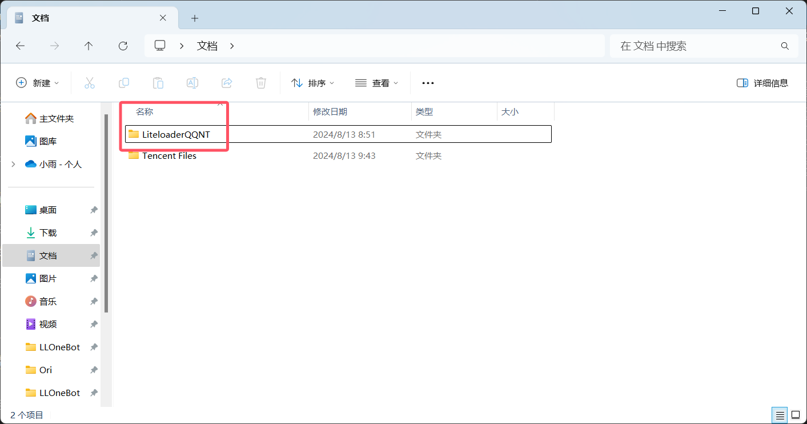
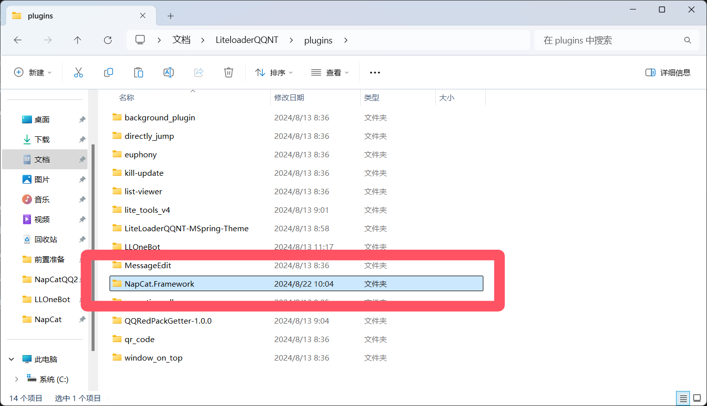

::: danger
本站该教程已经过作者允许上传

另外请勿将与本教程任何相关内容上传至流量平台如：B站
:::

## ①安装LiteLoaderQQNT

- [脚本安装LiteLoaderQQNT](./LiteLoaderQQNT.md)
  - 便捷快速～
    
- [手动安装LiteLoaderQQNT](./LiteLoaderQQNT2.md)
  - 脚本安装失败可以尝试手动安装

启动NTQQ并前往设置查看是否安装成功

## ② 安装NapCat

1. 点击此处下载[NapCat](https://github.com/NapNeko/NapCatQQ/releases/download/v2.0.37/NapCat.Framework.zip)

3. 打开 文档（Documents）目录找到LiteloaderQQNT并打开LiteloaderQQNT\plugins

4. 将下载好的LLOneBot解压复制进改文件夹即可

3. 然后重启 NTQQ 并打开设置查看是否安装成功
