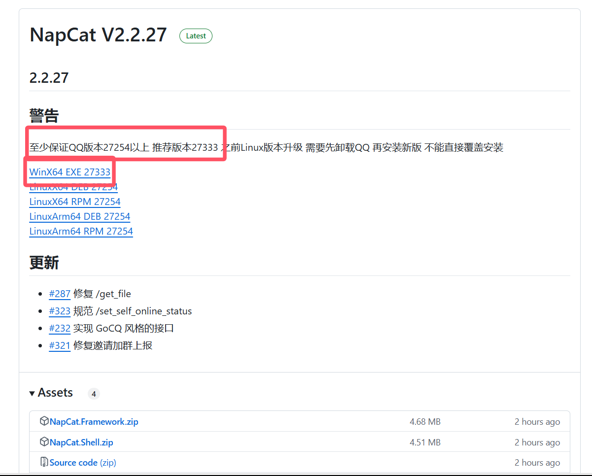
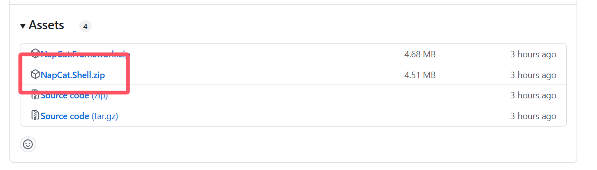
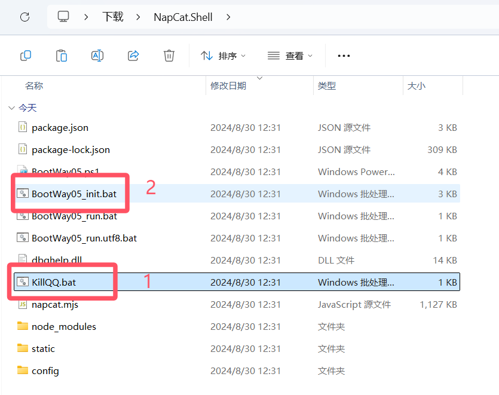
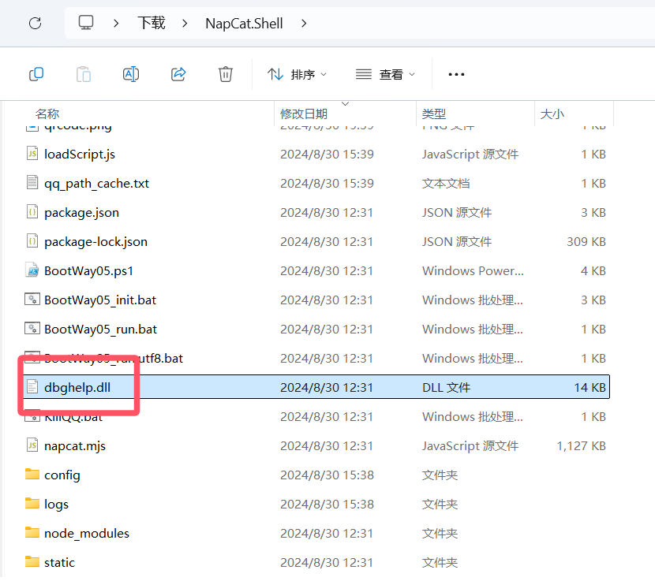
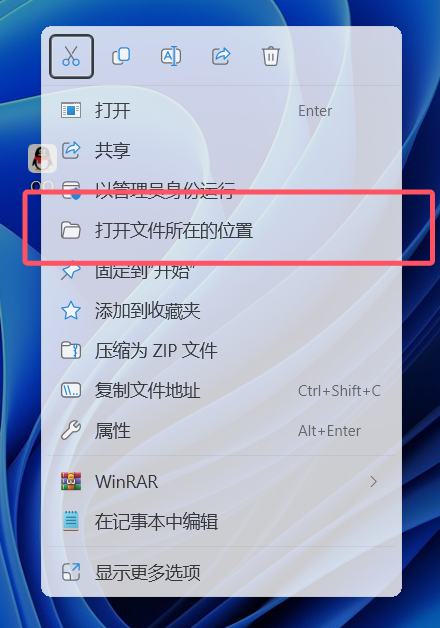
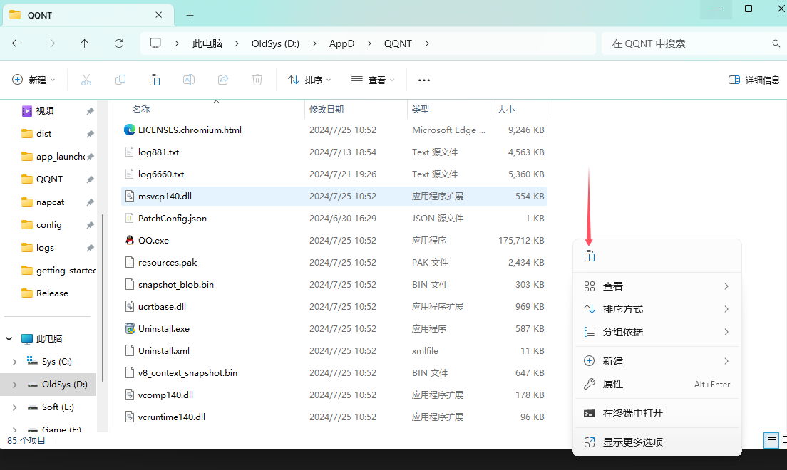
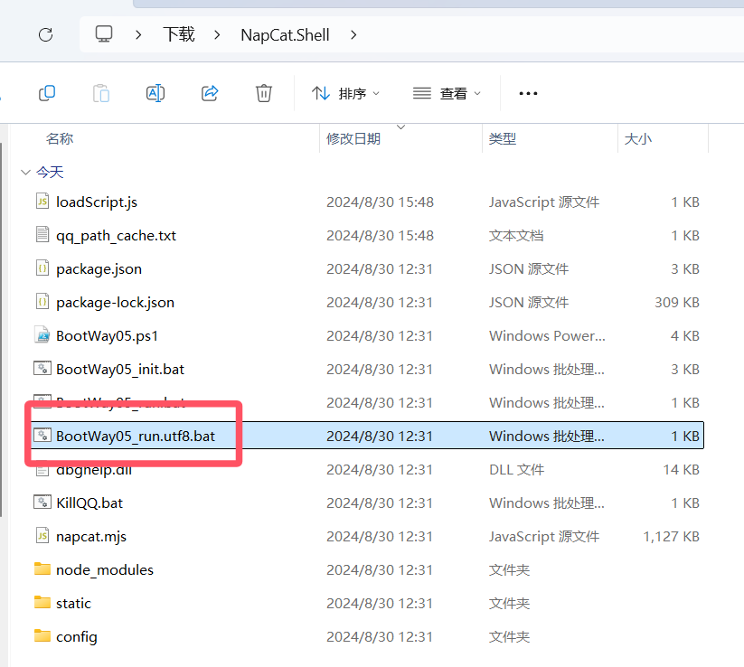

::: danger
本站该教程已经过作者允许上传

另外请勿将与本教程任何相关内容上传至流量平台如：B站
:::

# ①NapCat 相关

1. NapCat可以使你成为人机X（人机合一）

2. NapCat是基于 PC NTQQ 本体实现一套无头 Bot 框架。

3. NapCat可以使你的 NTQQ 支持 OneBot 11 协议进行 QQ 机器人开发的无需GUI界面的NTQQ

4. [NapCat官方文档](https://napneko.github.io/zh-CN)

5. 本教程以 NapCat V2.2.27 && NTQQ v9.9.15-27254 为例

## ②下载NTQQ

1. [点击此处前往查看支持的NTQQ](https://github.com/NapNeko/NapCatQQ/releases)
 - 也就是`releases`中给出的版本，下载`WinX64 EXE ***`即可



2. 安装NTQQ

## ③安装NapCatQQ

1. [还是点击此处前往releases](https://github.com/NapNeko/NapCatQQ/releases)
 - 下载`releases`中最新版本的`NapCat.Shell.zip`即可



2. 解压并打开下载的NapCat.Shell.zip

首先双击运行`KillQQ.bat`后再运行`BootWay05_init.bat`
 - 运行后闪一下窗口时正常情况



3. 复制一下`dbghelp.dll`



4. 找到你桌面的QQ


鼠标对着他右键并点击打开文件所在位置（win10可能有所不同）



5. 点击粘贴，覆盖原有的 dbghelp.dll。（与QQ.exe同级目录）



6. 最后双击运行`BootWay05_run.utf8.bat`



7. 进行扫码登录（同一网络）

8. 关闭这个窗口

9. 打开`NapCatQQ\config\onebot11_你的QQ号.json`
 - 修改ws配置（在11-19行）

```
    "ws": {
        "enable": true,
        "host": "127.0.0.1",
        "port": 8080
    },
    "reverseWs": {
        "enable": true,
        "urls": ["ws://127.0.0.1:8080/onebot/v11/ws/"]
    },
```

10. 重新运行`BootWay05_run.utf8.bat`