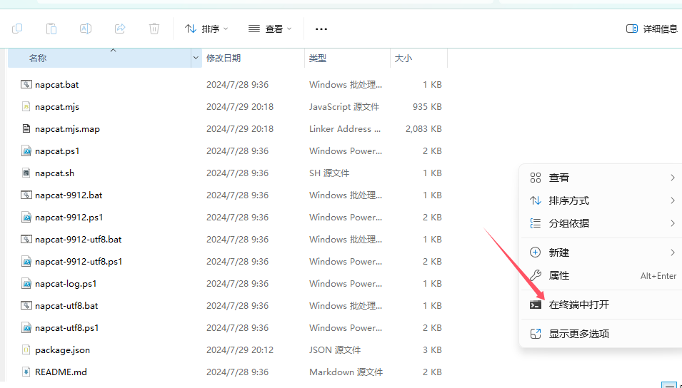
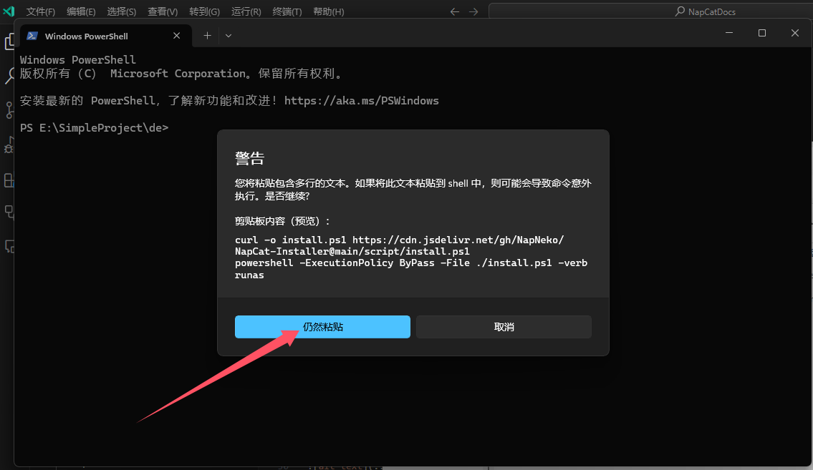
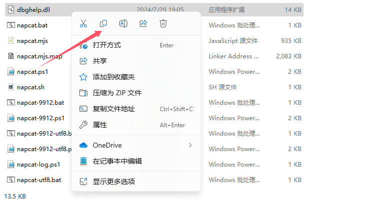
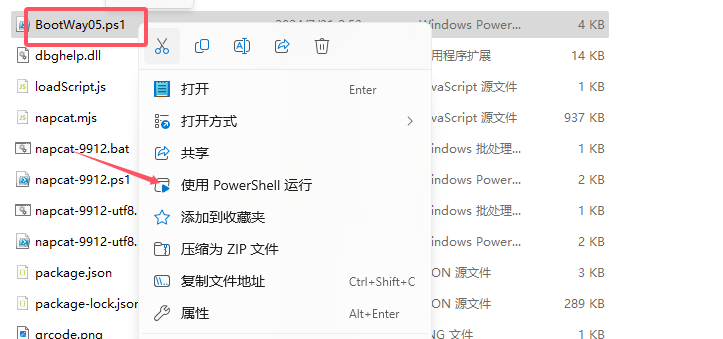

::: danger
本站该教程已经过作者允许上传

另外请勿将与本教程任何相关内容上传至流量平台如：B站
:::

# ①NapCat 相关

1. NapCat可以使你成为人机X（人机合一）

2. NapCat是基于 PC NTQQ 本体实现一套无头 Bot 框架。

3. NapCat可以使你的 NTQQ 支持 OneBot 11 协议进行 QQ 机器人开发的无需GUI界面的NTQQ

4. [NapCat官方文档](https://napneko.github.io/zh-CN)

5. 本教程以 NapCat V2.1.0 && NTQQ v9.9.15-27254 为例

## ②下载NTQQ

1. [点击此处前往QQ官网下载NTQQ](https://dldir1.qq.com/qqfile/qq/QQNT/Windows/QQ_9.9.15_240819_x64_01.exe)（必须27187以上）

2. 安装NTQQ

## ③安装NapCatQQ

1. 打开一个你想安装NapCat的目录

2. 在空白处右键，点击在终端打开。若无此选项卡，可以在地址栏中输入 wt 并回车。



3. 在终端中右键（不要用 Ctrl+V - 这样有可能造成不可预料的后果！），将刚刚的复制的代码粘贴进终端。如果终端有警告，点击仍然粘贴



4. 如果代码没动就回车一下，等到提示框弹出。

5. 首先找到你下载的 NC 目录内的文件 dbghelp.dll并复制它
 - 完成后不要关闭文件管理窗口，否则会影响剪贴板。



6. 打开安装的QQNT目录

找到你桌面的QQ


鼠标对着他右键并点击打开文件所在位置（win10可能有所不同）


7. 点击粘贴，覆盖原有的 dbghelp.dll。（与QQ.exe同级目录）


8. 打开下载NapCat的目录，终端输入
 - 输入后回车

```
powershell -ExecutionPolicy ByPass -File ./BootWay05.ps1
```

9. 打开`NapCatQQ\config\onebot11.json`
 - 修改

```
    "ws": {
        "enable": false,
        "host": "127.0.0.1",
        "port": 8080
    },
```

10. 再次启动
 - 再次运行只需要手动启动 PowerShell 脚本即可

 