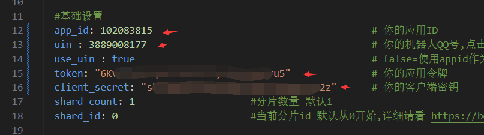
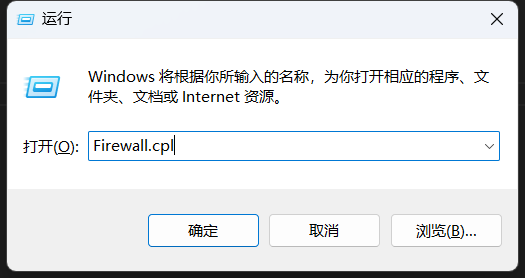
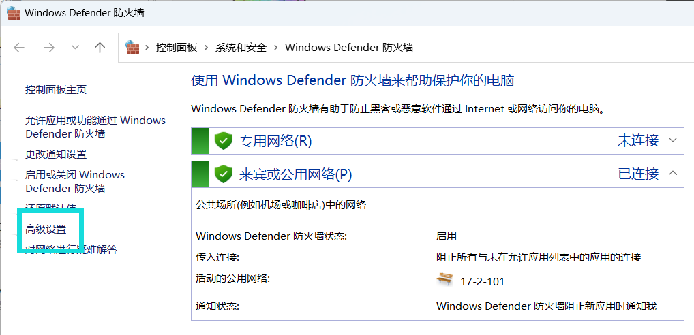

# 四 连接zhenxun_bot

<details>
  <summary>使用go-cqhttp连接真寻bot（不建议）</summary>

## ①下载go-cqhttp 

### gitee下载

请安装Git，已有可跳过

[点击我进行下载Git](https://registry.npmmirror.com/-/binary/git-for-windows/v2.43.0-rc0.windows.1/Git-2.43.0-rc0-64-bit.exe)

```
git clone --depth 1 https://gitee.com/SHIKEAIXYY/1.1.9unidbg_and_gocq.git
```
### zip下载 (不建议!)

[点击此处下载签名和go-cqhttp](https://gitee.com/SHIKEAIXYY/1.1.9unidbg_and_gocq/repository/archive/master.zip)

下载后请配置`windows_amd64`而`unidbg-fetch-qsign-1.1.9`一会要用

## ②配置go-cqhttp

1.打开config.yml文件，修改`QQ账号和密码`保存即可（先不要重新启动！！！）

 

# 部署签名api

### ①下载java 

1.[点击此处下载jdk](https://mirrors.tuna.tsinghua.edu.cn/Adoptium/17/jdk/x64/windows/OpenJDK17U-jdk_x64_windows_hotspot_17.0.10_7.msi)

2.安装完成后打开cmd运行`java`查看是否有输出

[如果没有输出点击此处查看如何配置变量，如果你看不懂那就没办法了](https://blog.csdn.net/qq_41436122/article/details/82620080)

配置完成后重新启动服务器后再打开cmd运行`java`查看是否有输出

### ②使用

1.打开`1.1.9unidbg_and_gocq\unidbg-fetch-qsign-1.1.9`双击运行`一键启动.bat` (就[下载go-cqhttp](https://gitee.com/SHIKEAIXY/zhenxun/blob/master/README.md#%E4%B8%8B%E8%BD%BDgo-cqhttp)下载的那个文件里面)

没有闪退即可使用（默认使用8.9.78版本）

2.签名启动成功后再重新启动 go-cqhttp.bat 登录即可

3.切记api不要关闭！！！

### ③配置

1.端口默认是`520`

2.key默认为`1314`

3.如需修改可打开`unidbg-fetch-qsign-1.1.9\txlib`找到你要修改的版本打开这个文件如修改`8.9.71`则打开`8.9.71\config.json`进行修改并修改gocq的配置文件


### ④启动 go-cqhttp

1.返回上一目录打开`windows_amd64`文件

2.双击 `go-cqhttp.bat` 进行验证即可


3.如果出现以下内容则不用管它，不影响登录和使用 **（如果你看着变扭请看下一条）** 

```
[WARNING]: Callback error: Packet timed out, Or response data is empty
[ERROR]: Protocol -> parse incoming packet error: return code unsuccessful: -10005
```

4.在gocq运行的页面中使用`ctrl+c`后输入下方内容回车重新启动即可
```
go-cqhttp
```

5.自动提交滑块ticket无反应
- 这个不知道有没有解决办法
- 如果没反应请使用`2. 手动抓取提交`
- [使用安卓手机点击此处下载](https://maupdate.rainchan.win/txcaptcha.apk)

### ⑤关于其他签名协议登录

1.现在个个版本都不稳定，看你63版本到最新版本哪个能登了

2.换登录版本教程在`go-cqhttp_windows_amd64\data\versions\修改版本.md`中

### 如果你使用了gocq还登录上就别~~作~~让他好好run

</details>

---

<details>
  <summary>使用[云崽]的[ws插件]跳过gocq使用icqq连接真寻bot（在2024年2月5号的晚上7点ICQQ删库...建议各位早日使用Gensokyo）</summary>

## 安装云崽

### ①安装前置

1. 请安装Git，已有可跳过

[点击我进行下载Git](https://registry.npmmirror.com/-/binary/git-for-windows/v2.43.0-rc0.windows.1/Git-2.43.0-rc0-64-bit.exe)

2. 下载node.js

[点击此处下载node.js](https://npmmirror.com/mirrors/node/v18.18.0/node-v18.18.0-x64.msi)

3. 右键鼠标打开`Open Git Bash here`

win11需先点击显示更多选项后才显示`Open Git Bash here`


 
然后运行下方命令
```
bash <(curl -L https://gitee.com/SHIKEAIXY/zhenxun/raw/master/Yunzai.sh)
```

<details>
  <summary>如果不想使用sh一键下载可点击此处手动下载</summary>

&nbsp;2.1. 在cmd依次输入以下内容并回车 

```
git clone --depth=1 https://gitee.com/yoimiya-kokomi/Miao-Yunzai.git ./Yunzai/Miao-Yunzai/
```
```
cd Yunzai/Miao-Yunzai
```
```
git clone --depth=1 https://gitee.com/yoimiya-kokomi/miao-plugin.git ./plugins/miao-plugin/
```
```
npm --registry=https://registry.npmmirror.com install pnpm -g
```
```
//可选
pnpm config set registry https://registry.npmmirror.com
```
```
pnpm install -P
```
```
git clone --depth=1 https://gitee.com/xiaoye12123/ws-plugin.git ./plugins/ws-plugin/
```
```
pnpm install --filter=ws-plugin
```
```
cd ..
```
```
git clone --depth 1 -b redis https://gitee.com/SHIKEAIXYY/Trss-ComWeChat-Yunzai.git ./redis
```
```
git clone --depth 1 https://gitee.com/touchscale/Qsign.git ./Qsign
```
</details>
&nbsp;

4. 下载jdk

[点击此处下载jdk](https://mirrors.tuna.tsinghua.edu.cn/Adoptium/17/jdk/x64/windows/OpenJDK17U-jdk_x64_windows_hotspot_17.0.10_7.msi)

#### ②说明

1. 安装完的`云崽`和`数据库`在你bat运行的同级目录`Yunzai`的文件夹中

2. `redis`为数据库

3. `Miao-Yunzai`为机器人本体

4. `Qsign`为签名api

### ③启动云崽

1. 请打开`Yunzai`文件夹

2. 运行`redis`数据库（运行`redis/双击我启动redis.bat`即可）

3. 运行`Qsign`（运行`Qsign/一键startAPI.bat`即可）默认是80的签名，端口为801，秘钥为114514

4. 启动机器人并配置

在`Miao-Yunzai`目录下cmd输入`node app`即可

#### ④机器人配置

1. 请输入机器人QQ号(建议用小号)：`这里输入机器人的QQ号即可`

2. 请输入登录密码(为空则扫码登录)：`这里输入机器人的QQ密码即可`

3. 请选择登录端口：`这里请通过方向键选择aPad！！！`（下面的图片选错了别跟着图片走！！！）

4. 请输入主人QQ号：`这里输入用来管理机器人的QQ号即可`

5. 请输入签名API地址（可留空）：`这里输入下方内容即可`

```
http://127.0.0.1:801/sign?key=114514
```

<details>
  <summary>使用他人提供的签名API</summary>

1. 签名API推荐使用78或85.
2. 由于签名API来自他人部署可能不稳定谨慎使用
3. API收集来自煌,聊群：695596638

<details>
  <summary>煌提供的签名API</summary>

1. 煌群：695596638

```
======「8.9.78」======
https://huai-huai-8-9-78.hf.space/sign?key=ngm
```
</details>

<details>
  <summary>叽叽叽提供的签名API</summary>

1. 叽叽叽群：未知

```
======「8.9.78/83/90/93」======
http://114.132.243.116:10078/sign?key=114514
======「在config/bot.yaml里添加：（XXX为版本如ver: 83）」======
======「ver: XXX」======
```
</details>

<details>
  <summary>小运提供的签名API</summary>

1. 小运群：未知

```
======「8.9.78」======
ttp://salipet.com:1535/sign?key=2394
======「8.9.83」======
http://salipet.com:1692/sign?key=2394
```
</details>

<details>
  <summary>咕咕咕提供的签名API</summary>

1. 咕咕咕群：235589956或339695166
2. 签名状态：http://47.108.180.154:3001/status/qsign
```
======「8.9.78」======
http://47.108.180.154:8978/sign?key=114514  
======「8.9.85」======
http://47.108.180.154:8985/sign?key=114514
======「8.9.88」======
http://47.108.180.154:8988/sign?key=114514
======「8.9.90」======
http://47.108.180.154:8990/sign?key=114514
======「8.9.93」======
http://47.108.180.154:8993/sign?key=114514
```
</details>

</details>


5. 触发滑动验证，需要获取ticket通过验证，请选择获取方式:`这里选择 0.自动获取ticket 进行扫码即可`

6. 查看云崽bot是否正常运行，如运行成功请关掉云崽重新输入`node app`并回车启动机器人

7. 连接本地bot(给云崽机器人QQ发送)

```
#ws添加连接
``` 
```
zhenxun_bot,1
``` 
```
ws://127.0.0.1:8080/onebot/v11/ws/
``` 
8. 发送`#ws查看连接`来查看是否连接成功

出现带以下内容的图片，则代表连接成功
```
连接名字: zhenxun_bot
连接类型: 1
当前状态: 已连接
```
### 注意不要关闭云崽和真寻本体

如果连接失败大概率就是你关了真寻或者真寻启动失败了

</details>

---

<details>
  <summary>使用Gensokyo(QQBot)连接真寻bot</summary>

# 没必要评价第三方好还是官方好，各有各的好处和弊端，能接受就用，接受不了就别用，别一天天的骂来骂去，~~你就算骂也别骂到人家开发者上去，咱能不能有点良心？~~ 
# 别拿着建议的理由去骂开发者，人家更不更新跟你什么关系，没强迫你更新吧？你要是认为Gensokyo更新太快就别用，把开发者气跑了你就开心高兴了？

### ①说明：

1. 新框架`Gensokyo` 视频：[点击此处跳转](https://www.bilibili.com/video/BV1Aw411K7Z5)

2. `Gensokyo`仓库：[点击此处跳转](https://github.com/Hoshinonyaruko/Gensokyo
)
3. `Gensokyo`gitee镜像：[点击此处跳转](https://gitee.com/sanaefox/Gensokyo
)
4. `Gensokyo`教程: [点击此处跳转](https://www.bilibili.com/read/cv27523883
)
5. `Gensokyo`的`web端`用户名和密码已全部修改为`zhenxun`

6. `Gensokyo` QQ群：196173384

### ②注册企业账号

1. 随随便便注册一个企业qq开放平台账号：https://q.qq.com


2. 登录企业qq开放平台账号并创建机器人


3. 填好信息后点击下一步

4. 打开后点击`基础信息-信息`


5. 点击`详情`


6. 点击`进入认证`后填写相关信息并点击提交审核进行认证（目前不认证无法上线机器人，可沙箱使用）


### ④下载配置Gensokyo

1.下载gensokyo-windows-amd64（取用v355，更新时间2024.3.23）若发现教程的Gensokyo版本更新，可以选择无视更新
```
git clone --depth 1 -b gensokyo-windows-amd64 https://gitee.com/SHIKEAIXY/zhenxun.git ./Gensokyo
```

2. 打开下载的`Gensokyo`后并双击打开`config.yml`

3. 打开之前的网站`q.qq.com`点击`开发-开发设置`并复制`QQ号 ID 令牌 秘钥`填写到`config.yml配置文件`的7~9行




4. 将自己服务器的公网ip填入`server_dir`


5. 并开放端口号`15630`（不配置将无法发送图片）

打开防火墙(不会可以`按住win键+R键`输入`Firewall.cpl`并点击确定)



打开防火墙后点击`高级设置`



然后点击`入站规则`并`新建规则`


选择端口后下一页


然后填写端口`15630`并下一页


然后一直下一页即可，名字随便起

6. 如果你没有公网ip可使用早苗的图床

将`server_dir`和`port`修改为下方内容

```
server_dir: "sanae.online"
port: "443" 
``` 
然后将`lotus`的`false`设置为`true`后保存即可使用


7. 以上完成后双击运行`gensokyo.bat`不出意外就可以运行了

### ⑤配置沙箱使用机器人

1. 打开QQ点击新创建聊群（不超过20人的群）

2. 再次回到网站`q.qq.com`

3. 点击`开发-沙箱配置`后找到`在QQ群配置`将聊群修改为刚刚创建的聊群（如果失败就几秒后再试试）


4. 接下来回到QQ打开刚刚创建的聊群，点击右上角的`三个横杠`，点击`管理群-群机器人`，找到你的机器人点击添加

5. 接下来@机器人并发送真寻帮助查看是否可以发图  如：@冰祈 真寻帮助
6. 如果不行自己查看上文中让填写的ip是否为公网ip并且开放了端口号，如都设置了还不行那就找作者去，我不到啊

**注意！！！**
 
 `zhenxun_bot`与`Gensokyo`需全部运行，不可关闭

</details>

---
