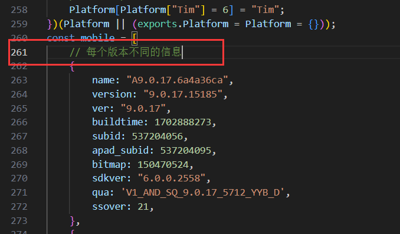

## 安装云崽

### ①安装前置

1. 下载Node.Js（20以上的Node.Js！！！）

[点击此处下载Node.Js](https://mirrors.tuna.tsinghua.edu.cn/nodejs-release/v20.9.0/node-v20.9.0-x86.msi)

2. 右键鼠标打开`Open Git Bash here`

Win11需先点击显示更多选项后才显示`Open Git Bash here`


 
因为TRSS Yunzai不依赖与Miao-Plugin与Genshin(俩大型原神插件)，所以本教程使用TRSS崽

然后运行下方命令
```
bash <(curl -L https://gitee.com/SHIKEAIXY/zhenxun/raw/master/Yunzai.sh)
```

<details>
  <summary>如果不想使用sh一键下载可点击此处手动下载</summary>

&nbsp;2.1. 在cmd依次输入以下内容并回车 

```
git clone --depth 1 https://gitee.com/TimeRainStarSky/Yunzai ./Yunzai/TRSS-Yunzai
```
```
cd Yunzai/TRSS-Yunzai
```
```
git clone --depth 1 https://gitee.com/TimeRainStarSky/Yunzai-ICQQ-Plugin ./plugins/ICQQ-Plugin
```
```
git clone --depth=1 https://gitee.com/xiaoye12123/ws-plugin.git ./plugins/ws-plugin/
```
```
npm --registry=https://registry.npmmirror.com install pnpm -g
```
```
//可选
pnpm config set registry https://registry.npmmirror.com
```
```
pnpm i
```
```
cd ..
```
```
git clone --depth 1 -b redis https://gitee.com/SHIKEAIXYY/Trss-ComWeChat-Yunzai.git ./redis
```
</details>
&nbsp;

#### 配置ICQQ版本信息

1. 打开路径`Yunzai\TRSS-Yunzai\plugins\ICQQ-Plugin\node_modules\icqq\lib\core`
 - `没有node_modules`这个文件夹就是你依赖没装（pnpm i）

2. 找到`device.js`文件并打开

3. 翻到第`261`行



4. 在`261`行后面换成转到`262`行


5. 在`262`行顶格位置粘贴下方内容后保存即可


```
    {
        name: "A9.0.70.e4b76fcc",
        version: "9.0.70.17645",
        ver: "9.0.70",
        subid: 537228487,
        apad_subid: 537228526,
        qua: "V1_AND_SQ_9.0.70_6698_YYB_D",
        channel: "GuanWang",
        sdkver: "6.0.0.2561",
        buildtime: 0x666bfec0,
        bitmap: 0x08f7ff7c,
        ssover: 0x15,
    },
```

6. 至此修改完成

#### ②说明

1. 安装完的`云崽`和`数据库`在你bat运行的同级目录`Yunzai`的文件夹中

2. `redis`为数据库

3. `Trss-Yunzai`为机器人本体

### ③启动云崽

1. 请打开`Yunzai`文件夹

2. 运行`redis`数据库（运行`redis/双击我启动redis.bat`即可）

3. 启动机器人并配置
 - 在`TRSS-Yunzai`目录下cmd输入`node app`即可
```
node app
```

当你启动报错237频繁登录/非常用设备登录：

 - 尝试扫码登录Bot
 - 与载挂Bot的设备同一网络登录
 - 在本地常用设备（可登录Bot的设备）进行登录后复制Yunzai/data/icqq/QQ号整个文件夹到服务器的Yunzai/data/路径中后重试

#### ④机器人配置

1. 等待Bot的启动完成

2. 对`该窗口(运行Yunzai的Cmd)`输入`以下内容并回车`
 - 白嫖hlh佬
```
#QQ签名https://hlhs-nb.cn/signed/?key=114514
```

3. 对`该窗口(运行Yunzai的Cmd)`输入`以下内容并回车`
 - 密码登录：QQ号 114514 密码 1919810 登录设备 安卓手机(1)/平板(2)，使用扫码登录因密码留空
```
#QQ设置114514:1919810:2
```

4. 设置主人：发送 `#设置主人`，`日志获取验证码`并发送（QQ设置主人）

5. 触发滑动验证，需要获取ticket通过验证，请选择获取方式:`这里选择 0.自动获取ticket 进行扫码即可`

6. 连接本地bot(给云崽机器人QQ发送)

```
#ws添加连接
``` 
```
zhenxun_bot,1
``` 
```
ws://127.0.0.1:8080/onebot/v11/ws/
``` 
7. 发送`#ws查看连接`来查看是否连接成功

出现带以下内容的图片，则代表连接成功
```
连接名字: zhenxun_bot
连接类型: 1
当前状态: 已连接
```
### 注意不要关闭云崽和真寻本体

如果连接失败大概率就是你关了真寻或者真寻启动失败了

