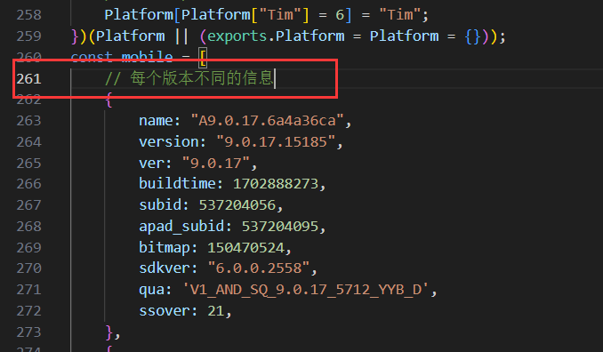
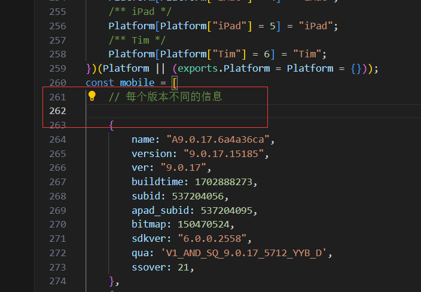
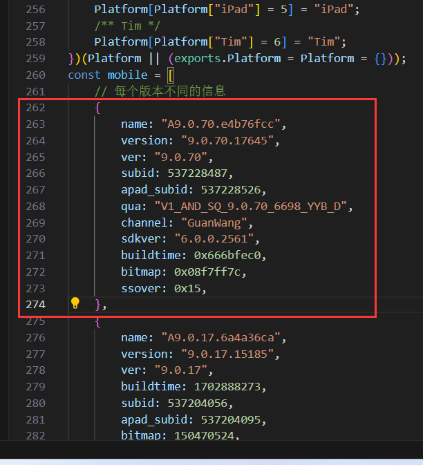
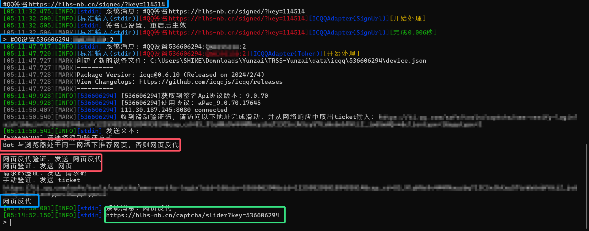

::: danger
请勿将与本教程任何相关内容上传至流量平台如：B站
:::

## 安装云崽

### ①安装前置

1. 下载Node.Js（20以上的Node.Js！！！）

[点击此处下载Node.Js](https://mirrors.tuna.tsinghua.edu.cn/nodejs-release/v20.9.0/node-v20.9.0-x86.msi)

2. 打开Cmd运行
 
因为TRSS Yunzai不依赖与Miao-Plugin与Genshin(俩大型原神插件)，所以本教程使用TRSS崽

然后依次运行下方命令

``` 
git clone --depth 1 -b redis https://gitee.com/SHIKEAIXYY/Trss-ComWeChat-Yunzai.git ./Yunzai/redis && git clone --depth 1 https://gitee.com/TimeRainStarSky/Yunzai ./Yunzai/TRSS-Yunzai && cd Yunzai/TRSS-Yunzai && git clone --depth 1 https://gitee.com/TimeRainStarSky/Yunzai-ICQQ-Plugin ./plugins/ICQQ-Plugin && git clone --depth=1 https://gitee.com/xiaoye12123/ws-plugin.git ./plugins/ws-plugin/ && npm --registry=https://registry.npmmirror.com install pnpm -g 
```
这里需要关闭cmd后重新打开一个cmd才可以用不然会报错没有pnpm（打开位置和刚刚一样即可）
```
pnpm config set registry https://registry.npmmirror.com && cd Yunzai/TRSS-Yunzai && pnpm i
``` 

#### 配置ICQQ版本信息

1. 打开路径`Yunzai\TRSS-Yunzai\plugins\ICQQ-Plugin\node_modules\icqq\lib\core`
 - `没有node_modules`这个文件夹就是你依赖没装（pnpm i）

2. 找到`device.js`文件并打开

3. 翻到第`261`行



4. 在`261`行后面换成转到`262`行



5. 在`262`行顶格位置粘贴下方任意一个版本内容后保存即可
 - 目前低于9.0.55已不能新增登录



使用任意一个即可，不是全部都填（反正用不到）

::: code-tabs#language

@tab 9.0.55

``` 
    {
        name: "A9.0.55.54f52314",
        version: "9.0.55.16820",
        ver: "9.0.55",
        buildtime: 1713424357,
        subid: 537220167,
        apad_subid: 537220206,
        bitmap: 150470524,
        sdkver: "6.0.0.2560",
        qua: 'V1_AND_SQ_9.0.55_6368_YYB_D',
        ssover: 21,
    },
``` 

@tab 9.0.56

``` 
    {
        name: "A9.0.56.c25547f8",
        version: "9.0.56.16830",
        ver: "9.0.56",
        subid: 537220323,
        apad_subid: 537220362,
        qua: 'V1_AND_SQ_9.0.56_6372_YYB_D',
        sdkver: "6.0.0.2560",
        buildtime: 0x6620c7e5,
        bitmap: 150470524,
        ssover: 21,
    },
``` 

@tab 9.0.60

``` 
    {
        name: "A9.0.60.c5f71993",
        version: "9.0.60.17095",
        ver: "9.0.60",
        subid: 537222797,
        apad_subid: 537222836,
        qua: "V1_AND_SQ_9.0.60_6478_YYB_D",
        channel: "GuanWang",
        sdkver: "6.0.0.2560",
        buildtime: 0x6620c7e5,
        bitmap: 150470524,
        ssover: 21,
    },
``` 

@tab 9.0.65

``` 
    {
        name: "A9.0.65.530ce28d",
        version: "9.0.65.17370",
        ver: "9.0.65",
        subid: 537225139,
        apad_subid: 537225178,
        qua: "V1_AND_SQ_9.0.65_6588_YYB_D",
        channel: "GuanWang",
        sdkver: "6.0.0.2560",
        buildtime: 0x6620c7e5,
        bitmap: 150470524,
        ssover: 21,
    },
``` 

@tab:active 9.0.70

```
    {
        name: "A9.0.70.e4b76fcc",
        version: "9.0.70.17645",
        ver: "9.0.70",
        subid: 537228487,
        apad_subid: 537228526,
        qua: "V1_AND_SQ_9.0.70_6698_YYB_D",
        channel: "GuanWang",
        sdkver: "6.0.0.2561",
        buildtime: 0x666bfec0,
        bitmap: 0x08f7ff7c,
        ssover: 0x15,
    },
```

@tab:active 9.0.71

```
    {
        name: "A9.0.71.e2f45246",
        version: "9.0.71.17655",
        ver: "9.0.71",
        subid: 537228643,
        apad_subid: 537228682,
        qua: "V1_AND_SQ_9.0.71_6702_YYB_D",
        channel: "GuanWang",
        sdkver: "6.0.0.2561",
        buildtime: 0x666bfec0,
        bitmap: 0x08f7ff7c,
        ssover: 0x15,
    },
```

@tab:active 9.0.75

```
    {
        name: "A9.0.75.c0dc0382",
        version: "9.0.75.17920",
        ver: "9.0.75",
        subid: 537230737,
        apad_subid: 537230776,
        qua: "V1_AND_SQ_9.0.75_6808_YYB_D",
        channel: "GuanWang",
        sdkver: "6.0.0.2561",
        buildtime: 0x666bfec0,
        bitmap: 0x08f7ff7c,
        ssover: 0x15,
    },
```
:::

6. 至此修改完成

#### ②说明

1. 安装完的`云崽`和`数据库`在你bat运行的同级目录`Yunzai`的文件夹中

2. `redis`为数据库

3. `Trss-Yunzai`为机器人本体

### ③启动云崽

1. 请打开`Yunzai`文件夹

2. 运行`redis`数据库（运行`redis/双击我启动redis.bat`即可）

3. 启动机器人并配置
 - 在`TRSS-Yunzai`目录下cmd输入`node app`即可
```
node app
```

#### ④机器人配置

1. 等待Bot的启动完成

2. 对`该窗口(运行Yunzai的Cmd)`输入`以下内容并回车`
 - 白嫖hlh佬
```
#QQ签名https://hlhs-nb.cn/signed/?key=114514
```

3. 对`该窗口(运行Yunzai的Cmd)`输入`以下内容并回车`
 - 密码登录：QQ号 114514 密码 1919810 登录设备 安卓手机(1)/平板(2)，使用扫码登录因密码留空
```
#QQ设置114514:1919810:2
```
4. 然后根据提示输入（在cmd内输入即可）
 - 如果你是服务器不是一个网络则发送：网页反代
 - 如果是一个网络则发送：网页

5. 最后点击URL进行验证即可：如图



当你启动报错237频繁登录/非常用设备登录：
 - 尝试扫码登录Bot
 - 与载挂Bot的设备同一网络登录：网页反代
 - 在本地常用设备（可登录Bot的设备）进行登录后复制plugins\ICQQ-Plugin\Model\device.js整个文件到服务器的plugins\ICQQ-Plugin\Model\后重试

6. 设置主人：发送 `#设置主人`，`日志获取验证码`并发送（在QQ设置主人：大号给Bot小号发）

7. 连接本地bot(给云崽机器人QQ发送)

```
#ws添加连接
``` 
```
zhenxun_bot,1
``` 
```
ws://127.0.0.1:8080/onebot/v11/ws/
``` 
7. 发送`#ws查看连接`来查看是否连接成功

出现带以下内容的图片，则代表连接成功
```
连接名字: zhenxun_bot
连接类型: 1
当前状态: 已连接
```
### 注意不要关闭云崽和真寻本体

如果连接失败大概率就是你关了真寻或者真寻启动失败了

