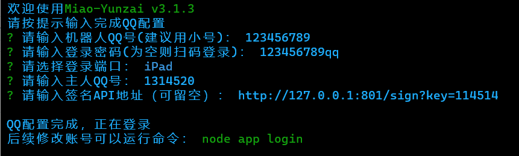
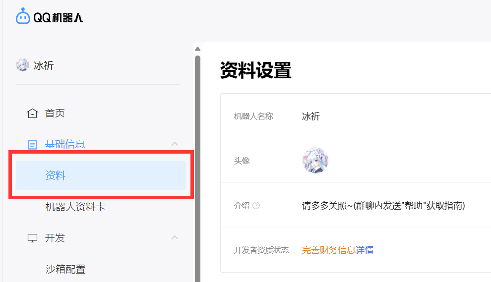
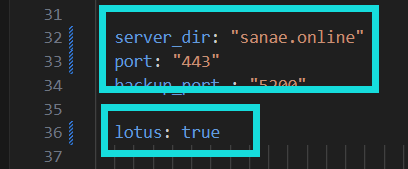
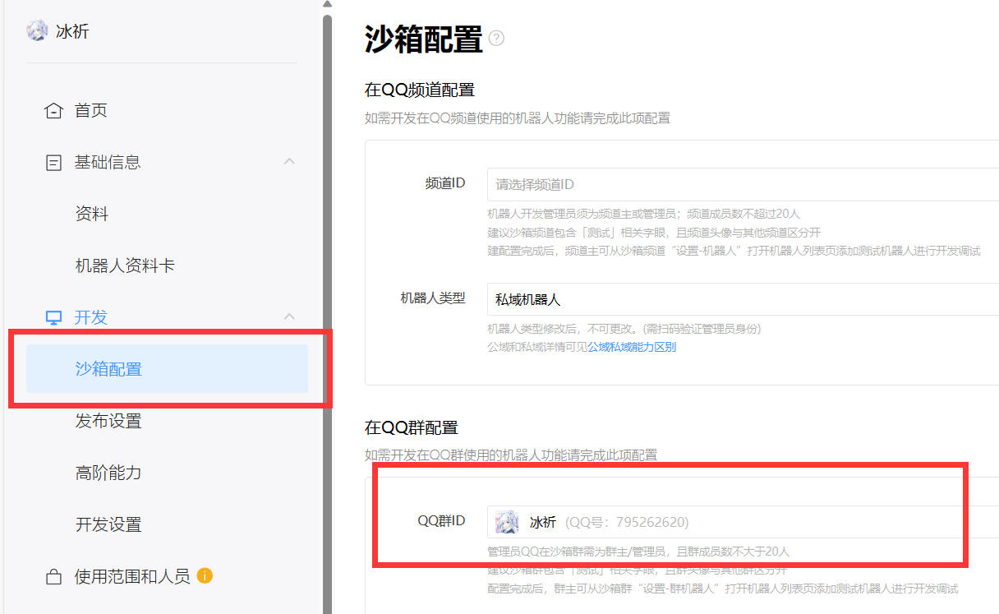

# 六 连接zhenxun_bot

<details>
  <summary>使用go-cqhttp连接真寻bot（不建议）</summary>

# 再提醒你一句，gocq作者已经不再更新，签名服务以无法解决gocq45问题

## ①安装go-cqhttp

1. 下载go-cqhttp（此时我们的目录在root/Bot）

```
git clone --depth 1 -b go-cqhttp_1.2.0_linux_arm64.deb https://gitee.com/SHIKEAIXY/zhenxun.git ./go-cqhttp
```

2. 打开root/Bot/go-cqhttp/config.yml，修改qq账号和密码，后保存

3. 安装unidbg-fetch-qsign（返回root/Bot目录终端输入）

先安装一下jdk
```
sudo apt update&&sudo apt install openjdk-8-jdk
```

然后下载unidbg-fetch-qsign
```
git clone --depth 1 https://gitee.com/touchscale/Qsign
```

然后启动unidbg-fetch-qsign（此处的8.9.78可修改）
```
cd Qsign
screen -S api
cd unidbg-fetch-qsign&&bash bin/unidbg-fetch-qsign --basePath=txlib/8.9.78
```

4. 启动go-cqhttp（此时应该在root/Bot/go-cqhttp目录终端输入）

输入以下内容回车即可
```
screen -S gocq
go-cqhttp
```

5. 我说过gocq寄了，无法登录就更换签名版本（唯一的办法，不一定能行）

6. 关于screen命令说明：

* screen命令一般用于Linux的持久化运行
* 其中下方命令当中的name为创建screen窗口的名称
```
screen -S name //创建一个screen窗口
screen -r name //打开这个screen窗口
screen -ls     //查看全部screen窗口
screen -S name -X quit  //删除这个screen窗口
```

</details>

---

<details>
  <summary>使用[云崽]的[ws插件]跳过gocq使用icqq连接真寻bot（在2024年2月5号的晚上7点ICQQ删库...建议各位早日使用Gensokyo）</summary>

## 安装云崽

### ①安装前置

1. 下载node.js

<details>
  <summary>使用宝塔面板安装node.js（非终端）</summary>

打开宝塔的软件商店搜索`Node.js版本管理器`并下载20.9.0的版本（也可以下载16/18的版本）


</details>

<details>
  <summary>使用XTerminal安装node.js（终端安装）</summary>

终端依次输入下方内容

```
sudo apt install apt-transport-https curl ca-certificates software-properties-common
curl -sL https://deb.nodesource.com/setup_18.x | sudo -E bash -
sudo apt-get install -y nodejs
```

</details>

2.安装云崽机器人（此时应该在root/Bot目录）

```
bash <(curl -L https://gitee.com/SHIKEAIXY/zhenxun/raw/linux/Yunzai.sh)
```

<details>
  <summary>如果不想使用sh一键下载可点击此处手动下载</summary>

&nbsp;2.1. 在终端root/Bot目录依次输入以下内容并回车 

```
git clone --depth=1 https://gitee.com/yoimiya-kokomi/Miao-Yunzai.git ./Miao-Yunzai/
```
```
cd Miao-Yunzai
```
```
git clone --depth=1 https://gitee.com/yoimiya-kokomi/miao-plugin.git ./plugins/miao-plugin/
```
```
git clone --depth=1 https://gitee.com/xiaoye12123/ws-plugin.git ./plugins/ws-plugin/
```
```
npm --registry=https://registry.npmmirror.com install pnpm -g
```
```
//可选
pnpm config set registry https://registry.npmmirror.com
```
```
pnpm i
```
```
pnpm add puppeteer@19.7.3 -w
```
</details>
&nbsp;

3. 安装redis数据库

<details>
  <summary>使用宝塔面板安装redis数据库（非终端）</summary>

还是打开软件商店搜索`redis`（剩下的你自己搞吧，这么简单你不会还不会吧？）

</details>

<details>
  <summary>使用XTerminal安装redis数据库（终端安装）</summary>

终端输入下方内容

```
sudo apt install redis-server
```

安装完成后 Redis 服务会自动启动

可以使用以下命令来检查 Redis 服务的运行状态（如果 Redis 服务正在运行，你将看到类似于 "active (running)" 的输出）

```
sudo systemctl status redis-server
```

Redis 在系统启动时自动启动可以使用下方命令

```
sudo systemctl enable redis-server
```

</details>

4. 安装unidbg-fetch-qsign（此时应该在root/Bot目录）

先安装一下jdk
```
sudo apt update&&sudo apt install openjdk-8-jdk
```

然后下载unidbg-fetch-qsign
```
git clone --depth 1 https://gitee.com/touchscale/Qsign
```

然后启动unidbg-fetch-qsign（此处的8.9.78可修改）
```
cd Qsign
screen -S api
cd unidbg-fetch-qsign&&bash bin/unidbg-fetch-qsign --basePath=txlib/8.9.78
```

#### ④机器人/配置（此时应该在root/Bot目录执行）

```
cd Miao-Yunzai
screen -r yunzai
node app
```

1. 请输入机器人QQ号(建议用小号)：`这里输入机器人的QQ号即可`

2. 请输入登录密码(为空则扫码登录)：`这里输入机器人的QQ密码即可`

3. 请选择登录端口：`这里请通过方向键选择aPad！！！`（图片选错了，别跟着图片走！！！）

4. 请输入主人QQ号：`这里输入用来管理机器人的QQ号即可`

5. 请输入签名API地址（可留空）：`这里输入下方内容即可`

```
http://http://127.0.0.1:801/sign?key=114514
```

<details>
  <summary>使用他人提供的签名API</summary>

1. 签名API推荐使用78或85.
2. 由于签名API来自他人部署可能不稳定谨慎使用
3. API收集来自煌,聊群：695596638

<details>
  <summary>煌提供的签名API</summary>

1. 煌群：695596638

```
======「8.9.78」======
https://huai-huai-8-9-78.hf.space/sign?key=ngm
```
</details>

<details>
  <summary>叽叽叽提供的签名API</summary>

1. 叽叽叽群：未知

```
======「8.9.78/83/90/93」======
http://114.132.243.116:10078/sign?key=114514
======「在config/bot.yaml里添加：（XXX为版本如ver: 83）」======
======「ver: XXX」======
```
</details>

<details>
  <summary>小运提供的签名API</summary>

1. 小运群：未知

```
======「8.9.78」======
ttp://salipet.com:1535/sign?key=2394
======「8.9.83」======
http://salipet.com:1692/sign?key=2394
```
</details>

<details>
  <summary>咕咕咕提供的签名API</summary>

1. 咕咕咕群：235589956或339695166
2. 签名状态：http://47.108.180.154:3001/status/qsign
```
======「8.9.78」======
http://47.108.180.154:8978/sign?key=114514  
======「8.9.85」======
http://47.108.180.154:8985/sign?key=114514
======「8.9.88」======
http://47.108.180.154:8988/sign?key=114514
======「8.9.90」======
http://47.108.180.154:8990/sign?key=114514
======「8.9.93」======
http://47.108.180.154:8993/sign?key=114514
```
</details>

</details>



5. 触发滑动验证，需要获取ticket通过验证，请选择获取方式:`这里选择 0.自动获取ticket 进行扫码即可`

6. 查看云崽bot是否正常运行，如运行成功请关掉云崽重新输入`node app`并回车启动机器人

7. 连接本地bot(给云崽机器人QQ发送)

```
#ws添加连接
``` 
```
zhenxun_bot,1
``` 
```
ws://127.0.0.1:8080/onebot/v11/ws/
``` 
8. 发送`#ws查看连接`来查看是否连接成功

出现带以下内容的图片，则代表连接成功
```
连接名字: zhenxun_bot
连接类型: 1
当前状态: 已连接
```
### 注意不要关闭云崽和真寻本体

如果连接失败大概率就是你关了真寻或者真寻启动失败了

</details>

---

<details>
  <summary>使用Gensokyo(QQBot)连接真寻bot</summary>

# 没必要评价第三方好还是官方好，各有各的好处和弊端，能接受就用，接受不了就别用，别一天天的骂来骂去，~~你就算骂也别骂到人家开发者上去，咱能不能有点良心？~~
# 别拿着建议的理由去骂开发者，人家更不更新跟你什么关系，没强迫你更新吧？你要是认为Gensokyo更新太快就别用，把开发者气跑了你就开心高兴了？

### ①说明：

1. 新框架`Gensokyo` 视频：https://www.bilibili.com/video/BV1Aw411K7Z5

2. `Gensokyo`仓库：https://github.com/Hoshinonyaruko/Gensokyo

3. `Gensokyo`gitee镜像：https://gitee.com/sanaefox/Gensokyo

4. `Gensokyo`教程 https://www.bilibili.com/read/cv27523883

5. `Gensokyo`的`web端`用户名和密码已全部修改为`zhenxun`

6. `Gensokyo` QQ群：196173384

### ②注册企业账号

1. 随随便便注册一个企业qq开放平台账号：https://q.qq.com


2. 登录企业qq开放平台账号并创建机器人


3. 填好信息后点击下一步

4. 打开后点击`基础信息-信息`



5. 点击`详情`


6. 点击`进入认证`后填写相关信息并点击提交审核进行认证（目前不认证无法上线机器人，可沙箱使用）


### ④下载配置Gensokyo

1. 下载gensokyo-linux-amd64（取用v336，更新时间2024.2.24，且此时应该在root/Bot目录）若发现教程的Gensokyo版本更新，可以选择无视更新
```
git clone --depth 1 -b gensokyo-linux-amd64 https://gitee.com/SHIKEAIXY/zhenxun.git ./Gensokyo
```

2. 打开下载的`Gensokyo`后并双击打开`config.yml`（此时应该在root/Bot/Gensokyo路径中）

3. 打开之前的网站`q.qq.com`点击`开发-开发设置`并复制`ID 令牌 秘钥`填写到`config.yml配置文件`的7~10行


4. 将自己服务器的公网ip填入`server_dir`


5. 并开放端口号`15630`（不配置将无法发送图片，不会就百度搜下吧）

6. 如果你没有公网ip可使用早苗的图床

将`server_dir`和`port`修改为下方内容

```
server_dir: "sanae.online"
port: "443" 
``` 
然后将`lotus`的`false`设置为`true`后保存即可使用



7. 以上完成后，输入下方内容命令（此时应该在root/Bot/Gensokyo路径中）

```
screen -S gsk
./gensokyo-linux-amd64
```
如果执行上方命令后出现出现`-bash: ./gensokyo-linux-amd64: Permission denied`可使用下方命令赋予权限并使用sudo执行
```
chmod +x gensokyo-linux-amd64
sudo ./gensokyo-linux-amd64
```

8. 关于screen命令说明：

* screen命令一般用于Linux的持久化运行
* 其中下方命令当中的name为创建screen窗口的名称
```
screen -S name //创建一个screen窗口
screen -r name //打开这个screen窗口
screen -ls     //查看全部screen窗口
screen -S name -X quit  //删除这个screen窗口
```

### ⑤配置沙箱使用机器人

1. 打开QQ点击新创建聊群（不超过20人的群）

2. 再次回到网站`q.qq.com`

3. 点击`开发-沙箱配置`后找到`在QQ群配置`将聊群修改为刚刚创建的聊群（如果失败就几秒后再试试）



4. 接下来回到QQ打开刚刚创建的聊群，点击右上角的`三个横杠`，点击`管理群-群机器人`，找到你的机器人点击添加

5. 接下来@机器人并发送真寻帮助查看是否可以发图  如：@冰祈 真寻帮助

6. 如果不行自己查看上文中让填写的ip是否为公网ip并且开放了端口号，如都设置了还不行那就去Gensokyo群问，我不到啊

**注意！！！**
 
 `zhenxun_bot`与`Gensokyo`需全部运行，不可关闭

</details>

---
