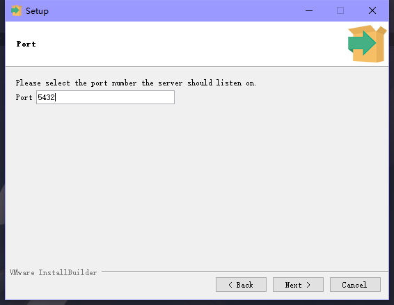
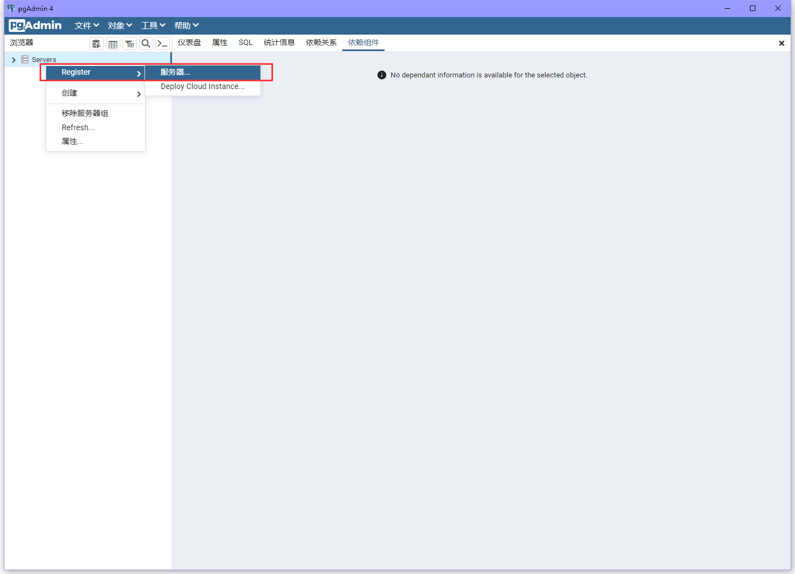

## 安装python与poetry

### 安装python

这里我推荐安装python3.10

[点击下载py3.10](https://yshs.lanzouy.com/iFMpG0gdwt9a)

下面两个对钩点上 然后点击Install Now等待安装完成


安装完成打开cmd输入py 查看是否有py版本输出

### ②安装poetry

1. 打开Powershell（需要管理员权限）运行

不会打开？不要慌 点击此处 [如何在Windows 10/11中打开PowerShell](https://www.51cto.com/article/696873.html)

打开后输入下面内容并回车（安装时间较长）

```
(Invoke-WebRequest -Uri https://install.python-poetry.org -UseBasicParsing).Content | python -
```

1.1 使用pip安装（此步骤无需进行2的变量环节）
```
python -m pip install -U pip
```
```
pip install poetry
```

2. 然后将`%APPDATA%\Python\Scripts`添加到PATH环境变量(位置在右键此电脑→属性→高级系统设置→环境变量)


3. 打开cmd发送poetry查看是否有版本输出

如果没有请重启电脑 重新打开cmd输入 poetry

还不行？[点击此处解决](https://www.baidu.com)

# 二 安装postgresql

## ①下载postgresql数据库
[点击此处将下载Postgresql-15.1-1版本安装包](https://get.enterprisedb.com/postgresql/postgresql-15.1-1-windows-x64.exe)

不想要15.1版本的可以自行下载别的版本（目前只要是9.0以上的版本都可以）

## ②安装postgresql数据库

1.双击安装程序，点击Next（打不开报错？系统用户名不能是中文，计算机名也不能是中文，其他问题。。。不要找我 我也不会）


2.选择安装路径（对路径没有要求不用改 默认c盘），继续Next

安装路径中不要出现中文！（防止报错）


3.去掉即可，不影响使用，Stack BuilderNext


4.数据存储路径（对路径没有要求不用改 默认c盘），Next


5.输入postgres用户的密码，例如：zhenxun（防止后期问题请按照本教程的密码输入 上下全部输入zhenxun）


6.默认端口，Next



7.接下来一路点Next直到进入安装


8.显示下面的图 代表你安装完成


## ③配置连接

1.找到安装的pgAdmin启动数据库 并启动

打开方法一： 在应用中搜索 pgAdmin 点击展开 找到下面img显示的打开即可


[是英文怎么办？点击此处解决](https://blog.csdn.net/weixin_46329056/article/details/125929563?ydreferer=aHR0cHM6Ly93d3cuYmFpZHUuY29tL2xpbms%2FdXJsPUwzNmhIRml6RjMwd2QzWnFEanFpY0NLYzFGbmlGUktRTXhCU21UTmFObjZNM0NxLUY5YzJzYV9IY2kzekV5bEVlTTctNzZnWjVmNC15aTI3ZjE3V3JJVDRnUzMtejdlTHp6aFJPY1Y2Tm9XJndkPSZlcWlkPTgyNjY3OTdjMDAwZTA0NGEwMDAwMDAwMjY0M2FiNDZj)

2.新建连接

左侧栏右键点击后选择，在点击ServersRegister服务器



随便给它起一个响亮的名字（


填写配置，如果是连接远程服务器的话对应的服务器IP，本地的话可以直接填写 就是安装时配置的端口，没有修改的话默认

就是安装时配置
的密码主机名称/地址127.0.0.1端口5432 密码就是你安装是输入的密码（本教程前面用的是zhenxun）


 3.点击保存
左侧栏会出现一个可爱真寻


## ④新建数据库

1.点击展开

2.右击，选择后点击数据库创建数据库


3.直接创建

设置数据库名称后点击保存 


ok火速下一步
